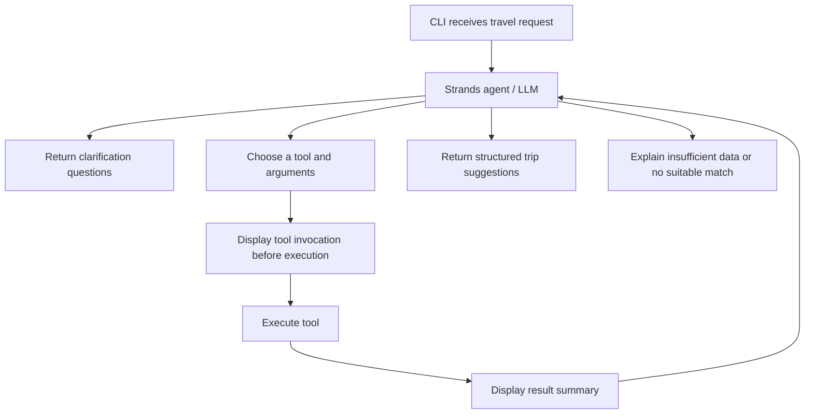

# Genuine coding conversation

Exported in source order. Tool records are in `transcript.jsonl`. Credentials and home paths are redacted; internal reasoning/instructions/telemetry are omitted.

## user · 2026-10-05T00:28:18.141Z · source line 6

<environment_context>
  <cwd><USER_HOME>/labplace/Vayo/TakeHomeTestRun</cwd>
  <shell>zsh</shell>
  <current_date>2026-10-04</current_date>
  <timezone>America/Los_Angeles</timezone>
  <filesystem><workspace_roots><root><USER_HOME>/labplace/Vayo/TakeHomeTestRun</root></workspace_roots><permission_profile type="managed"><file_system type="restricted"><entry access="read"><special>:root</special></entry><entry access="write"><path><USER_HOME>/labplace/Vayo/TakeHomeTestRun</path></entry><entry access="write"><special>:slash_tmp</special></entry><entry access="write"><special>:tmpdir</special></entry><entry access="read"><path><USER_HOME>/labplace/Vayo/TakeHomeTestRun/.git</path></entry><entry access="read"><path><USER_HOME>/labplace/Vayo/TakeHomeTestRun/.agents</path></entry><entry access="read"><path><USER_HOME>/labplace/Vayo/TakeHomeTestRun/.codex</path></entry><entry access="read"><path><USER_HOME>/labplace/Vayo/TakeHomeTestRun/.aws</path></entry></file_system></permission_profile></filesystem>
</environment_context>

## user · 2026-10-05T00:28:18.177Z · source line 9

test

## assistant · 2026-10-05T00:28:19.775Z · source line 12

Ready. What would you like to test?

## user · 2026-10-05T00:29:21.021Z · source line 19

can you run a deep reseach into this link: https://you.ashbyhq.com/atlas-seattle/assignment/5f677a30-2a08-458b-885e-c6703a2b1e18, first let me know if you could access it or not

## assistant · 2026-10-05T00:29:22.682Z · source line 22

I’ll check whether I can access the link and see the assignment content.

## assistant · 2026-10-05T00:29:45.207Z · source line 46

I can reach the link, but **I can’t read the assignment content yet**. It returns a “Take-Home Assignment” page that requires JavaScript; the available web tool can’t render it, and no connected browser is available.

Please paste the assignment text or upload a PDF/screenshots, and I can research it in depth.

## user · 2026-10-05T00:31:39.890Z · source line 53

i have created a local copy for you: <USER_HOME>/labplace/Vayo/TakeHomeTestRun/Take-Home Assignment.html, can you read it?

## assistant · 2026-10-05T00:31:42.030Z · source line 56

I’ll read the local HTML and check whether it includes the assignment instructions.

## assistant · 2026-10-05T00:31:49.547Z · source line 68

I can read the [local HTML file](<<USER_HOME>/labplace/Vayo/TakeHomeTestRun/Take-Home Assignment.html>), but **it doesn’t contain the assignment instructions**—only the loading screen and JavaScript that fetches the content.

Open the original link in your browser, wait for the instructions to appear, then **Print → Save as PDF** and save it in this folder. Alternatively, paste the visible text here.

## user · 2026-10-05T00:32:59.775Z · source line 75

i have created a pdf version for you as well:  <USER_HOME>/labplace/Vayo/TakeHomeTestRun/Take-Home Assignment.pdf

## assistant · 2026-10-05T00:33:01.434Z · source line 78

I’ll use the PDF skill to read the file and confirm the assignment content is available, then research its requirements.

## assistant · 2026-10-05T00:33:59.708Z · source line 140

The PDF is present. I’m extracting its text and rendering the pages to check that the assignment was captured completely.

## assistant · 2026-10-05T00:34:17.494Z · source line 156

Yes—the PDF contains the full assignment. It asks for a two-hour “Trip Idea” agent with at least three tools, structured output, an eval harness, and a detailed record of how you worked with your coding assistant.

The key emphasis is your decision-making and process, including what you deliberately cut. I’ll focus the research on an implementation approach and eval design that fit that brief.

## assistant · 2026-10-05T00:35:31.486Z · source line 177

**Yes—I can read the complete assignment from the PDF.** It includes the build requirements, evaluation criteria, process deliverables, and submission instructions. :codex-file-citation{path="<USER_HOME>/labplace/Vayo/TakeHomeTestRun/Take-Home Assignment.pdf" purpose="source"}

I also checked the relevant implementation documentation. My assessment is that **a small, well-evaluated TypeScript CLI with an honest decision log is the strongest fit.**

The assignment’s priorities are unusually explicit:

| Required deliverable | What matters |
|---|---|
| Single-turn Trip Idea agent | One travel request produces a structured response |
| At least three tools | Cover destinations, flights, accommodation, and budget through defensible boundaries |
| Typed output | Destinations, reasoning, rough budget, and caveats |
| Missing-information handling | Ask questions, flag uncertainty, or return a partial answer |
| Eval harness | At least five cases, two scoring dimensions, and a summary report |
| Configurable LLM | Document provider, model, credentials, and failure behavior |
| Process evidence | Full transcripts, 5–10 annotated prompts, and a reflection |
| Runnable repository | Working code, README, and eval output |

The brief explicitly excludes UI, live travel APIs, persistence, authentication, deployment, and production infrastructure. It gives both a five-minute setup target and a two-minute clean-clone target; I would aim for the stricter target and state its prerequisites.

**The main engineering challenge is preserving the meaning of the request.**

The supplied examples test different kinds of ambiguity:

| Example | Behavior worth testing |
|---|---|
| “Cheap.” | Ask useful clarification questions without inventing dates, departure airport, or travelers |
| Beach week under $2,000 for two | Treat the budget as covering both travelers; distinguish airfare per person from hotel per room |
| Europe, hotel under $300/night | Preserve the nightly hotel limit without treating it as the total trip budget |
| Family during spring break | Preserve children’s ages and pool requirement; flag ambiguous dates and room occupancy |
| Anniversary, hated Santorini | Respect the exclusion and treat $4,000 as a warning threshold |
| Lisbon wedding plus five days | Preserve the existing Lisbon flight and account separately for onward transport |
| Tokyo, $6,000 excluding flights | Keep flights outside the budget comparison; explain any nights assumption |

A schema-valid answer can still fail all of these. That is why the eval design deserves substantial time.

**My recommended implementation is a bounded, structured workflow.**

Use TypeScript with a CLI entry point, runtime schema validation, and a small LLM integration. Next.js is optional in the brief; a CLI keeps the work focused.

A defensible sequence would be:

1. Extract preferences, constraints, exclusions, and unknowns into a validated request.
2. Return clarification questions if essential information is missing.
3. Find candidates from a small mock destination catalog.
4. Retrieve mock flight and accommodation estimates.
5. Calculate costs in ordinary code.
6. Generate a concise explanation grounded in those results, then validate the final response.

I would use three tools—`findDestinations`, `estimateFlights`, and `findAccommodation`—plus a deterministic budget function. This satisfies the minimum while keeping arithmetic easy to inspect. The workflow is explicitly allowed by the assignment; the model does not need unrestricted control over execution.

The current AI SDK supports schema-based output through `generateText` and `Output.object()`, including combinations with tools. Its documentation also warns that final structured output needs an execution step of its own when using a tool loop. Pin the package version and follow matching documentation. [AI SDK structured-output documentation](https://ai-sdk.dev/docs/ai-sdk-core/generating-structured-data)

For the response contract, I would distinguish:

- `suggestions`: supported options with budgets and caveats.
- `needs_clarification`: specific questions with no invented recommendation.
- `no_match`: understood constraints that the mock catalog cannot satisfy.
- `error`: configuration, provider, or invalid-output failure.

Budget fields should carry currency, pricing units, included/excluded costs, and assumptions. An unknown flight cost must remain unknown; representing it as zero could produce a false “within budget” result.

**The eval should measure correctness beyond formatting.**

Use the seven supplied examples, then add a contradictory request and a tool returning no results. Score three dimensions separately:

| Dimension | Example checks |
|---|---|
| Contract validity | Runtime schema passes; required fields exist |
| Constraint preservation | Exclusions honored; budget scope and party size retained; clarification used appropriately |
| Grounding and budget consistency | Selected IDs exist in tool results; prices match fixtures; totals recompute correctly |

Report failures by case and dimension. A single aggregate score can hide systematic failures.

One particularly useful check: change a hotel’s mock price or remove its pool amenity and verify that the recommendation changes appropriately. This tests whether the agent actually uses tool results.

Keep offline fixture tests distinguishable from live model evals. Both are useful, but only the latter provide evidence about actual model behavior.

**Provider choice should follow a quick compatibility check.**

Before building the entire workflow, verify that the chosen endpoint can produce your schema—and call tools if you choose model-directed orchestration.

OpenRouter’s documentation says structured-output support varies by provider endpoint, even for the same model. It recommends `require_parameters: true` to route to compatible endpoints and notes that strict-schema enforcement still varies. Local validation remains necessary. [OpenRouter structured-output documentation](https://openrouter.ai/docs/guides/features/structured-outputs)

Document the exact model tested and make missing credentials, invalid credentials, and invalid output produce clear failures. No model was benchmarked during this research, so I would not claim a particular free model is reliable yet.

**The process deliverable should shape how we work from the beginning.**

The brief explicitly places substantial weight on annotated prompts and your judgment. Preserve actual exchanges, including corrections and unsuccessful attempts. The highlights should explain decisions you genuinely made: changing a schema, rejecting excess scope, catching a budget error, or cutting an unnecessary feature.

Your reflection should accurately distinguish what you reviewed, what you tested, and what remains uncertain. Preparation and research time should also be disclosed clearly if it contributes to the submission.

A practical two-hour allocation is:

| Work | Minutes |
|---|---:|
| Scope, schema, provider smoke test | 15 |
| Mock tools and budget calculation | 25 |
| Agent workflow and failure handling | 30 |
| Evals and targeted fixes | 25 |
| README, PROCESS.md, transcript, clean-run check | 25 |

The most valuable early decision is to reserve that final documentation and verification time. Those deliverables are central to what Atlas says it will evaluate.

## user · 2026-10-05T00:39:52.630Z · source line 184

before we start on building things, one thing i am not clear is that we deliverables are we shipping here in the end? a working CLI agent plus some evaluations, and others should be able to run it within 5min/2min frame?

## assistant · 2026-10-05T00:40:04.061Z · source line 187

Yes. **The final submission is a GitHub repo containing a working CLI agent, evaluations, and documentation of your development process.** A UI or deployed service is not required.

Concretely, we would ship:

| Deliverable | What it contains |
|---|---|
| **Working CLI agent** | Accepts a travel request, uses at least three tools backed by mock travel data, and returns structured suggestions or clarification questions |
| **Eval harness + results** | At least five cases, scored on at least two dimensions, with a saved summary report |
| **README.md** | Install/run/eval commands, provider/model configuration, required environment variables, credential failure behavior, and known limitations |
| **Full coding-assistant transcript(s)** | Actual prompts and responses from the development sessions |
| **PROCESS.md** | 5–10 annotated prompts, key decisions and cuts, what you reviewed, and a short reflection—including how you would approach scaling |
| **Time spent** | Approximate total, explaining any overrun beyond two hours |

The timing requirements refer to different things:

- **~2 hours:** Your intended development budget.
- **Under 5 minutes:** The README should get a reviewer running.
- **Under 2 minutes from a clean clone:** A second, stricter setup requirement elsewhere in the brief. We should target this, with prerequisites such as Node.js and an API key stated clearly.

The reviewer’s intended experience would look roughly like:

```bash
git clone <repo>
cd <repo>
npm ci
cp .env.example .env
# Add their API key and model configuration.

npm run trip -- "Relaxing beach week in February under $2000 for two, leaving from JFK."
npm run eval
```

Those are proposed commands, not something we have built yet. The setup target is about quickly reaching a working application; the brief does not specify that the entire live eval suite must finish within two minutes.

**The agent must make real LLM calls; the travel tools can use mock data.** The submission should make both the working behavior and your engineering decisions easy to inspect.

## user · 2026-10-05T00:46:50.336Z · source line 194

for "**The agent must make real LLM calls; the travel tools can use mock data**": so during the readme, we should let others can use the working github repo with their own LLM APIs? and what is **PROCESS.md** about really?

## assistant · 2026-10-05T00:47:00.432Z · source line 197

Yes—**the reviewer should be able to clone the repo, supply their own LLM API key, and run the agent.** We provide the integration and configuration instructions, but never commit our key.

For example, the README could explain:

```env
LLM_PROVIDER=openrouter
LLM_MODEL=<supported-model-id>
OPENROUTER_API_KEY=<your-own-key>
```

We should document which provider/model we actually tested, how to configure it, and what happens if credentials are missing or invalid. **We don’t need to support every provider**—a clearly documented, configurable integration is enough. We should state exactly which providers are supported.

The destination, flight, and hotel tools can return hardcoded sample data. The LLM still interprets the user’s request and helps produce the suggestion.

**`PROCESS.md` explains how you worked with the coding assistant and exercised engineering judgment.** The transcript is the complete record; `PROCESS.md` guides the reviewer to the meaningful decisions.

The assignment requests two parts:

1. **5–10 annotated prompts.** For each real prompt, explain what you wanted, what the assistant returned, and what you kept, changed, or rejected—and why.
2. **A short reflection.** Explain your overall approach, what you manually reviewed versus trusted, what you would do differently, and what you would change at 10,000 requests per hour.

A hypothetical entry might look like this:

> **Decision: calculate budgets in code**
>
> **Prompt:** “Move budget arithmetic into a deterministic function; keep the LLM responsible for explaining the trade-offs.”
>
> **Context:** The initial implementation let the model calculate totals, which made mistakes difficult to diagnose.
>
> **Result and judgment:** The assistant extracted a budget function. I checked the per-person flight and per-room hotel calculations and kept the change because we could test those rules directly.

We would include that only if it actually happened.

They are looking for evidence that **you directed, questioned, reviewed, and understood the work**. We can record decisions as we build, then use the real conversation to assemble `PROCESS.md`; your personal reflection should accurately represent what you actually reviewed and decided.

## user · 2026-10-05T00:48:42.591Z · source line 204

for "1. **5–10 annotated prompts**", is it for real testing travel agent, or during the dev work with coding agent actually? i believe the latter case, right?

## assistant · 2026-10-05T00:48:46.110Z · source line 207

Correct—**the latter: prompts you send to the coding assistant during development**, not travel requests sent to the finished agent.

Examples include asking the coding assistant to design the schema, simplify tool orchestration, investigate a failed eval, or remove unnecessary features.

For each selected prompt, explain:

- What you were trying to accomplish.
- What the coding assistant produced.
- What you accepted, changed, or rejected—and why.

The travel requests belong in the **eval harness**. The development prompts and your commentary belong in **`PROCESS.md`**.

## user · 2026-10-05T00:49:33.921Z · source line 214

another question, i don't like to use next.js and i am more familiar with python, can we use python actually? i want to audie the whole process actually

## assistant · 2026-10-05T00:49:40.911Z · source line 219

**Yes—Python is explicitly allowed.** The assignment says the stack is your choice. They prefer Next.js/TypeScript for review familiarity, but explicitly say they aren’t evaluating a particular framework.

Python makes sense if you want to **audit and understand the whole implementation**. Being able to review the code and defend the decisions fits their evaluation criteria.

We can keep the design small and readable:

- **CLI:** Accept a travel request and print structured JSON.
- **Pydantic schemas:** Define and validate requests, tool results, and responses.
- **Three Python tools:** Mock destination, flight, and accommodation data.
- **Explicit orchestration:** A straightforward function showing when the LLM and tools run.
- **Budget calculation:** Ordinary Python arithmetic.
- **Eval script:** Run cases and produce scores plus a summary.

For the development process, we can work in small stages: agree on the contract, implement tools, connect the LLM, then evaluate. At each stage, you can inspect the code, question decisions, and request changes. Those actual interactions become useful material for `PROCESS.md`.

We can explain the stack choice simply: **“I chose Python because it lets me implement, inspect, and test the system confidently within the time budget.”**

## user · 2026-10-05T00:51:01.060Z · source line 226

before we get started, do we need to use any existing agent development framework, like strands by AWS, openAI SDK etc, will that make the whole thing more straightforward and more easier?

## assistant · 2026-10-05T00:51:04.568Z · source line 231

I’ll compare a small Python implementation with Strands and OpenAI’s SDK options, focusing on what makes this assignment easier to build and audit. I’m using the OpenAI documentation skill to check the SDK distinctions.

## assistant · 2026-10-05T00:51:51.489Z · source line 256

**We don’t need an agent framework, but one can reduce the tool-calling boilerplate.** For your goal—understanding and auditing the implementation—I would start with **Python + Pydantic + a provider’s API SDK**, using a small, explicit workflow.

There’s an important distinction between the two OpenAI options:

| Option | What it handles | What we write |
|---|---|---|
| **OpenAI Python SDK** | Communication with the model API | Orchestration, tool execution, validation, and stopping conditions |
| **OpenAI Agents SDK** | Agent execution loop and function-tool integration | Tools, instructions, application rules, and evaluations |
| **Strands Agents SDK** | Agent loop, Python function tools, provider integration, and structured output support | Tools, instructions, application rules, and evaluations |

With the ordinary OpenAI API, the model can request a function call, but our application executes the function and sends the result back. The Agents SDK handles that repeated interaction through its runner. [Function-calling documentation](https://developers.openai.com/api/docs/guides/function-calling), [Agents SDK quickstart](https://developers.openai.com/api/docs/guides/agents/quickstart?lang=python)

Strands similarly lets us register Python functions with `@tool` and request a Pydantic-validated result. It can run locally with a configured provider; using Strands does not inherently require AWS deployment. [Strands quickstart](https://strandsagents.com/docs/user-guide/sdk/quickstart/python/), [structured output](https://strandsagents.com/docs/user-guide/sdk/agents/structured-output/)

**Whether a framework makes this easier depends on the orchestration we choose.**

- **Fixed workflow:** Extract preferences → execute relevant tools → calculate budget → produce the answer. Plain Python makes this straightforward and easy to inspect.
- **Model-directed tool loop:** The model chooses which tool to call next, sees the result, and continues. Strands or the Agents SDK saves more work here.

The assignment explicitly accepts either approach. Also, **“single-turn” means one user request and one response; it can still involve several internal model calls and tool executions.**

For us, I recommend the fixed workflow initially because you can directly follow where each input goes, which tools run, and how the final budget is calculated. The tools, schema, missing-information rules, and evaluations remain our responsibility whichever library we choose.

**If you already know Strands, using it would be a reasonable alternative.** If you would be learning it during this assignment, I would keep the dependencies smaller and spend that time reviewing the agent’s behavior and eval results.

## user · 2026-10-05T00:58:33.714Z · source line 263

i am already familiar with strands, so i would prefer use strands framework, and i believe strands also directly support evaluations. however, would that add complications and dependencies for testing purpose? would others need to import strands during testing?

## assistant · 2026-10-05T00:58:37.583Z · source line 266

I’ll check how Strands separates its agent SDK from its evaluation tools, and what a reviewer would need to install.

## assistant · 2026-10-05T00:58:54.679Z · source line 281

**Since you already know Strands, let’s use it.** It adds dependencies, but we can make installation straightforward for reviewers.

You’re also right about evaluations: Strands provides a **separate package, `strands-agents-evals`**, for running cases, applying evaluators, and producing reports. [Strands Evals documentation](https://strandsagents.com/docs/user-guide/evals-sdk/)

**Reviewers need the packages installed, but they don’t need to write any imports or understand Strands.** Our code handles the imports. We declare dependencies so one installation command sets everything up.

For example, we could provide these commands:

```bash
pip install -e ".[eval,test]"

python -m trip_agent "Beach week under $2000 for two, leaving JFK"
python -m trip_agent.evaluate
pytest
```

These are proposed commands; we’ll implement and verify them.

The useful distinction is between **testing the code** and **evaluating the live agent**:

| Activity | Dependencies | LLM credentials needed? |
|---|---|---|
| Run the agent | Strands + selected provider integration | Yes |
| Run live agent evaluations | Above + Strands Evals | Yes, for the agent |
| Test budget arithmetic, schemas, and mock tools | Project dependencies + pytest | No |
| Read committed evaluation results | None | No |

**The main complication is using an LLM to judge another LLM.** That introduces extra calls, cost, configuration, and variability. Strands also supports deterministic and custom evaluators, so using its evaluation framework does **not** require an LLM judge. [Evaluator documentation](https://strandsagents.com/docs/user-guide/evals-sdk/evaluators/)

My recommendation is:

- **Strands** for the agent and tool execution.
- **Strands Evals with custom Python scorers** for constraint preservation, budget correctness, and grounding in tool results.
- **pytest** for a few focused tests of arithmetic and failure handling.
- **Pinned dependencies and explicit provider configuration** so reviewers reproduce the setup we tested.

The live evaluation will call the agent’s LLM, then score its output with ordinary Python. That gives us the framework you know while keeping the scoring easy to audit. We’ll measure the clean-install experience before claiming it meets the two-minute target.

## user · 2026-10-05T01:00:17.001Z · source line 288

ok, now we have our framework: strands + python, keep in mind the deliveables we discussed earlier.

## assistant · 2026-10-05T01:00:22.259Z · source line 291

Agreed: **Python + Strands**, with Strands Evals and deterministic Python scorers.

We’ll keep these deliverables in scope:

- Working single-turn CLI agent with at least three mock travel tools.
- Validated structured output and graceful handling of missing information.
- Configurable LLM provider/model using the reviewer’s own credentials.
- At least five evaluation cases, two scoring dimensions, and saved results.
- README with installation, run, and evaluation instructions; target the stricter two-minute setup requirement.
- Full development transcripts.
- `PROCESS.md` with 5–10 real annotated development prompts and your reflection.
- GitHub repository and an honest record of time spent.

We’ll build in small, reviewable stages so you can audit the implementation and make the decisions recorded in `PROCESS.md`.

## user · 2026-10-05T04:10:52.353Z · source line 298

let's start with - Working single-turn CLI agent with at least three mock travel tools. keep in mind that it is NOT a fixed/determined workflow, we want the model/LLM layer to be the orchestration layer through-out the whole project. The LLM - layers needs to understand user intents first, ask for questions for clarifications if original intents are too vague, and call tools if needed also helps to get clarification info... any tool invocations should be shown and displayed to users first to let them know context as well...before implementing on anything, i want to see your plans and repo structure first based on the framework and infra decisions we already made.

## assistant · 2026-10-05T04:10:59.558Z · source line 301

I’ll inspect the workspace and Strands’ current tool-event interfaces, then propose the execution model and repo structure for your review before writing code.

## assistant · 2026-10-05T04:12:14.421Z · source line 316

**We’ll use a single Strands agent with the LLM directing the entire interaction:** interpreting the request, deciding whether clarification is needed, choosing tools, interpreting results, and deciding when to answer. This replaces my earlier fixed-workflow proposal.

I inspected the workspace; there is no existing application code to build around. **No implementation changes have been made.**

**1. Agent behavior**

The CLI passes the original travel request to the agent. We provide instructions, typed tools, and a response schema; the model chooses its next action.



There is no required tool sequence and no requirement to call every tool. For example:

- **“Cheap.”** → The model can immediately ask about departure location, travelers, and budget.
- **“Somewhere warm near Lisbon.”** → It can explore destinations first, then ask a more useful question based on available options.
- **“Tokyo, $6,000 excluding flights.”** → It can skip flight estimates and focus on accommodation and other costs.
- **A tool finds no matching hotels.** → The model can explore another destination, explain the limitation, or ask which constraint is flexible.

Python handles tool execution, validation, arithmetic, and execution limits. Those boundaries support the model’s decisions without prescribing the itinerary-building sequence.

**2. Clarification within the single-turn requirement**

To preserve the assignment’s scope, **clarification questions are a valid final response for that invocation**. The CLI displays them and exits. The user can submit a more complete request in a new invocation.

An interactive question-and-answer loop that resumes the same conversation would introduce multi-turn behavior, which the assignment explicitly excludes.

Tools can resolve factual uncertainty or reveal useful options. They cannot supply unknown personal preferences such as the user’s departure airport or children’s school-break dates.

**3. Proposed tools**

I suggest **three mock lookup tools plus one budget tool**:

| Tool | Responsibility | Useful result details |
|---|---|---|
| `search_destinations` | Find destinations matching preferences and exclusions | Candidate IDs, matching attributes, limitations |
| `search_flights` | Retrieve illustrative route estimates | Price per traveler, route, pricing assumptions |
| `search_accommodations` | Retrieve illustrative stays | Nightly room price, occupancy, amenities |
| `calculate_trip_budget` | Calculate costs for model-selected options | Line items, totals, exclusions, unknown costs |

The first three use a small shared fixture catalog. The fourth uses deterministic arithmetic, but **the model decides when to invoke it and which options to compare**.

Tool responses distinguish successful matches, missing required inputs, and no matches. For example, an absent departure airport produces missing-input information rather than an invented flight estimate.

Mock prices and availability will be explicitly labeled as illustrative.

**4. Tool activity visible before execution**

Every tool execution will have a user-visible notice showing its name, relevant arguments, and a short description of the operation. A completion notice will summarize the result.

Illustrative terminal output:

```text
[Tool 1] search_destinations
Searching mock destinations: warm weather, near Lisbon.
[Result 1] Found 2 candidates.

[Tool 2] search_accommodations
Searching mock stays: destination=algarve, pool=true.
[Result 2] Found 2 stays; occupancy requires traveler count.

[Clarification]
How many adults and children are traveling?
```

We’ll enforce the pre-execution display through Strands’ `BeforeToolCallEvent`, with result reporting through `AfterToolCallEvent`. This makes visibility independent of whether the model remembers to announce its actions. [Strands hook-event documentation](https://strandsagents.com/docs/api/python/strands.hooks.events/)

Notices appear automatically; they do not require a confirmation click. Activity goes to **stderr**, and the final response goes to **stdout**, allowing users to save JSON while still seeing progress:

```bash
trip-agent "Your travel request" --json > result.json
```

**5. Response contract**

The final Pydantic model will contain:

- **Status:** `suggestions`, `needs_clarification`, or `no_match`.
- **Understood request:** Preferences and constraints the model identified.
- **Questions:** Specific missing information, when needed.
- **Suggestions:** Destinations, supporting reasons, selected options, and budget.
- **Assumptions and caveats:** Explicit uncertainty and mock-data limitations.

Credential and execution failures will produce a clear CLI error and nonzero exit code.

Strands supports requesting a Pydantic-validated structured result alongside tool use. [Strands structured-output documentation](https://strandsagents.com/docs/user-guide/sdk/agents/structured-output/)

**6. Proposed repository structure**

```text
.
├── pyproject.toml              # Dependencies, CLI entry point, eval/test extras
├── .env.example                # Provider/model settings; no secrets
├── .gitignore
├── README.md
├── PROCESS.md                  # Actual decisions and annotated development prompts
│
├── src/trip_agent/
│   ├── __init__.py
│   ├── __main__.py             # python -m trip_agent
│   ├── cli.py                  # Arguments, terminal rendering, exit codes
│   ├── agent.py                # Construct and invoke the Strands agent
│   ├── config.py               # Provider/model configuration and credentials
│   ├── prompts.py              # Agent instructions
│   ├── schemas.py              # Tool/result and final-response models
│   ├── events.py               # Before/after tool notices and captured events
│   ├── tools/
│   │   ├── __init__.py
│   │   ├── destinations.py
│   │   ├── flights.py
│   │   ├── accommodations.py
│   │   └── budget.py
│   └── data/
│       └── mock_catalog.json
│
├── tests/
│   ├── test_tools.py
│   ├── test_budget.py
│   └── test_cli.py
│
├── evals/                      # Subsequent deliverable
│   ├── cases.json
│   ├── evaluators.py
│   └── run.py
├── reports/                    # Saved evaluation results
└── transcripts/                # Development-assistant session exports
```

`agent.py` will wire together the model, prompt, tools, schema, and hooks. It will not contain destination-specific branching or a prescribed sequence of tool calls.

**7. Implementation stages for this first deliverable**

1. **Define the contracts and fixtures:** Review tool inputs/results, response shape, and a small consistent mock catalog.
2. **Build the tools:** Implement lookup behavior, missing-input responses, and budget arithmetic.
3. **Connect Strands:** Register tools, instructions, structured output, visible events, and a bounded execution budget.
4. **Add the CLI:** Human-readable output by default, JSON option, and clear configuration errors.
5. **Verify behavior:** Check immediate clarification, tool-assisted clarification, successful suggestions, empty results, and notices appearing before execution.

We’ll record real decisions in `PROCESS.md` as we work. The full evaluation deliverable follows this first working CLI.

**The remaining configuration choice is the initial LLM provider/model.** Python, Strands, local CLI execution, mock travel data, and model-directed orchestration are settled; no cloud deployment is needed.

## user · 2026-10-05T04:16:28.796Z · source line 323

in principle, any travel requests should contain origination, destination, and desired time frames and budget right, i believe destination is a must? agent to discuss it with users first, and then to get to know the origination and then date range and potentially budget and trip details. Additionally, all the tool returned results, user requests/prompts, extracted origination/destination/date ranges/agent initial responses should be stored as separate artifacts in addition to agent memory for the agent to load it up in the future...based on what i said here, come up with a new plan on the implementation, particularly on the artifacts/evidence persistence part

## assistant · 2026-10-05T04:16:46.662Z · source line 328

I’ll revise the plan around clarification and auditable artifacts. Two points matter: an open-ended trip request can start without a destination, and resumable conversations with persistent artifacts expand the assignment’s original single-turn scope. I’ll make that scope change explicit and check Strands’ persistence interfaces before proposing the design.

## assistant · 2026-10-05T04:17:41.166Z · source line 342

**We can add persistent artifacts and resumable clarification while keeping the LLM in charge of the conversation and tool selection.** I would make one adjustment to your premise: **a destination is needed for a specific route estimate, but it need not be known when the user starts.** Discovering a destination is a central purpose of this “Trip Idea” agent—the assignment includes several requests without one.

Also, persistent sessions and ongoing clarification expand the assignment’s explicitly stated scope. My proposal preserves a single-request entry point for evaluation and adds explicit session resumption for the behavior you want. We should document that extension and its development time.

No implementation changes yet. Here is the revised plan.

**1. Clarify progressively, with the model deciding what matters next**

The agent maintains a structured understanding of the trip:

| Field | How we represent it |
|---|---|
| Origin | Known location, ambiguous location, or unknown |
| Destination | Selected destination, candidate destinations, or open to suggestions |
| Timing | Exact dates, flexible window, duration, or unknown |
| Budget | Amount, currency, per-person/whole-party scope, inclusions, and flexibility |
| Travelers | Adults, children, ages where relevant |
| Preferences | Activities, accommodation, amenities, exclusions |
| Open questions | Missing information that affects the next useful action |

Destination discussion can come first when that is the user’s main uncertainty. But the model should recognize information already provided and choose useful questions rather than always asking destination → origin → dates.

For example:

> “I want a beach holiday, but don’t know where.”

The agent could ask about departure location and approximate month because those help narrow destinations. It could also consult the destination tool to offer meaningful choices.

**Tools can clarify available options; only the user can confirm their preferences.**

**2. Store three distinct forms of information**

| Storage | Purpose | Authority |
|---|---|---|
| **Evidence artifacts** | Preserve what the user said, what the model returned, and what tools returned | Original records of the interaction |
| **Trip-state snapshots** | Provide a concise, structured interpretation of current requirements | Derived interpretation, linked to evidence |
| **Strands session memory** | Restore conversation context across invocations | Framework-managed working context |

This distinction matters. A model-generated summary saying “budget is $3,000” should not become an unquestioned fact if the user actually said “maybe around $3,000, excluding flights.”

Strands supports persistence of messages and agent state. Its current documentation recommends `SnapshotSessionManager` with local storage for new Python single-agent sessions; we’ll verify that interface against our pinned SDK version. [Strands session persistence](https://strandsagents.com/docs/user-guide/sdk/agents/session-management/)

**3. Persist separate artifacts automatically**

Saving evidence should be guaranteed by application code and hooks, rather than depend on the LLM remembering to call a save tool.

For each user turn, save:

| Artifact | Contents |
|---|---|
| User request | Exact text, timestamp, session ID, turn ID |
| Prompt configuration | Application-authored instructions, tool definitions, output schema, model settings and versions |
| Model-call inputs | Application-visible messages and context supplied for each model call |
| Model responses | Initial and subsequent assistant messages, including clarification questions and tool requests |
| Tool-call inputs | Tool name, call ID, arguments, timestamp |
| Tool-call results | Full returned payload or failure—not just the terminal summary |
| Trip-state snapshots | Extracted origin, destinations, timing, budget, preferences, and evidence references |
| Final response | Structured result plus the text displayed to the user |
| Turn status | Completed, awaiting clarification, failed, or interrupted |

We’ll record observable messages and actions, without manufacturing a reasoning transcript.

Strands exposes message, model-call, and before/after-tool events that support this capture. [Strands hook lifecycle](https://strandsagents.com/docs/user-guide/sdk/agents/hooks-events/)

**4. Track where extracted facts came from**

Each extracted field should distinguish:

- **User-stated:** Directly supported by a user message.
- **Inferred:** A tentative interpretation.
- **Proposed:** An option suggested by the agent.
- **Unknown or conflicting:** Requires clarification.

For example:

```json
{
  "budget": {
    "amount": 3000,
    "currency": "USD",
    "scope": "whole_party",
    "excludes": ["flights"],
    "flexibility": "approximate",
    "status": "user_stated",
    "source_artifact_ids": ["turn-002-user-request"]
  }
}
```

If currency or scope was not stated, those fields remain unknown or explicitly inferred.

A later correction creates a **new snapshot** linked to the correcting message. Earlier snapshots remain available. Proposed destinations stay separate from a destination the user has selected.

The LLM will produce these updates through a typed `update_trip_state` tool. Python validates and saves them. Every final response also includes the current interpreted trip state, so a clarification-only turn still produces a snapshot.

**5. Use a simple local artifact layout**

```text
.trip-agent/                         # Runtime data; ignored by Git
└── sessions/
    └── <session-id>/
        ├── session.json             # Identity and configuration references
        ├── events.jsonl             # Ordered events referencing artifacts
        ├── current_trip.json        # Latest validated state; derived
        ├── memory/                  # Strands-managed session storage
        └── turns/
            └── <turn-id>/
                ├── user_request.json
                ├── prompt_config.json
                ├── model_calls/
                │   ├── 001_input.json
                │   ├── 001_response.json
                │   ├── 002_input.json
                │   └── 002_response.json
                ├── tool_calls/
                │   ├── <call-id>_input.json
                │   └── <call-id>_result.json
                ├── trip_states/
                │   ├── 001.json
                │   └── 002.json
                ├── final_response.json
                └── status.json
```

Each artifact gets an ID, type, schema version, timestamp, session/turn IDs, and relevant source references.

Completed evidence files are immutable. Small current-state pointers can be updated atomically. A tool input is saved **before execution**, and its result immediately afterward. Interrupted calls remain identifiable instead of looking successful. Persistence failures surface clearly.

For the initial local implementation, allow one active writer per session to avoid conflicting updates.

**6. Let the agent retrieve evidence explicitly**

On resumption, restore Strands memory and supply the latest trip-state snapshot with a compact artifact index. The model can retrieve details using:

- `list_artifacts`: Find records by type or turn.
- `read_artifact`: Read a specific artifact by ID within the current session.

These retrieval calls are announced and recorded like travel-tool calls. They do not accept unrestricted filesystem paths.

The model can then answer questions such as:

> “Why did you assume two adults?”

by retrieving the relevant user message and state snapshot.

Previous tool results retain their original inputs and mock-data version. Changing dates, party size, or destination means an old estimate may no longer apply; the agent should request an applicable estimate. Reading stored evidence is not the same as rerunning the model or refreshing data.

**7. Keep the CLI explicit about sessions**

Proposed usage:

```bash
# One request; create a new session and print its ID.
trip-agent "I want a relaxing beach trip"

# Continue that trip with an answer or correction.
trip-agent --session <id> "Leaving JFK in February, two adults"

# Inspect saved evidence without calling an LLM.
trip-agent artifacts --session <id>
```

Each invocation accepts one user message and returns one response. Reusing a session enables multi-turn behavior. Evaluation cases start with fresh isolated sessions unless specifically testing resumption.

**8. Repository changes and implementation order**

Keep the previous CLI, agent, schemas, travel tools, and mock catalog. Add:

```text
src/trip_agent/
├── persistence.py              # Artifact writes, IDs, index, atomic updates
├── session.py                  # Strands persistence and resume integration
├── events.py                   # Capture evidence and display tool activity
└── tools/
    ├── trip_state.py           # Validate and persist model-proposed updates
    └── artifacts.py            # List/read session evidence
```

Implementation order:

1. Define the trip-state and artifact schemas.
2. Build local persistence and verify correction/version behavior.
3. Add Strands memory restoration and event capture.
4. Connect the model-directed agent and travel tools.
5. Verify clarification, resumption, evidence retrieval, and interrupted runs.
6. Add the agreed evaluations and submission documentation.

The travel agent’s runtime artifacts are separate from the **coding-assistant transcripts** required for submission. `PROCESS.md` will explain our development decisions; the runtime artifacts will let us inspect what the finished travel agent actually did.

## user · 2026-10-05T04:24:45.551Z · source line 349

the artifacts should be stored through-out the same session: for example the same session should have a same artifacts stored from end to end and a different session should kick off a different session persistence. in the implementation, let's ensure that strands can aceept various backend LLM models from different provider: for example, openAI APIs, AWS bedrocks, claude APIs, open-router etc... embed this into your plan

## assistant · 2026-10-05T04:24:49.510Z · source line 354

I’ll update the plan so each session owns one continuous artifact store and memory history, with separate storage for every new session. I’ll also check Strands’ adapters for OpenAI, Bedrock, Anthropic, and OpenRouter so provider selection stays configurable.

## assistant · 2026-10-05T04:25:18.159Z · source line 368

Agreed. **The session will be the persistence boundary:** every turn in the same session contributes to the same artifact collection, trip state, and Strands memory. A new session starts with its own isolated storage.

I’ll incorporate both requirements into the plan as follows.

**1. One continuous artifact store per session**

```text
.trip-agent/
└── sessions/
    ├── <session-A>/
    │   ├── session.json
    │   ├── events.jsonl
    │   ├── artifact_index.json
    │   ├── current_trip.json
    │   ├── memory/                  # Strands session persistence
    │   └── artifacts/
    │       ├── requests/
    │       ├── model_inputs/
    │       ├── model_responses/
    │       ├── tool_calls/
    │       ├── tool_results/
    │       ├── trip_states/
    │       └── final_responses/
    └── <session-B>/
        └── ...                      # Independent history and artifacts
```

Each artifact has a unique ID plus `session_id`, `turn_id`, timestamp, and source references. Turns organize the history but **do not create separate persistence contexts**.

The behavior will be:

- **New session:** Generate a session ID and initialize empty memory, state, and artifact storage.
- **Continue session:** Restore that session’s memory and current state; append new evidence to its existing collection.
- **Correct earlier information:** Save a new state version while preserving the earlier evidence.
- **Retrieve evidence:** The agent’s artifact tools can access only the active session.
- **Unknown session ID:** Report an error rather than silently creating a replacement.

`current_trip.json` represents the latest interpretation. The underlying requests, responses, and tool results remain preserved end to end.

**2. Configurable model providers through Strands**

We’ll support these four provider configurations:

| Provider setting | Backend | Configuration |
|---|---|---|
| `openai` | OpenAI API | API key and model ID |
| `bedrock` | Amazon Bedrock | AWS credentials/profile, region, model or inference-profile ID |
| `anthropic` | Direct Claude API | Anthropic API key and model ID |
| `openrouter` | OpenRouter | OpenRouter API key and routed model ID |

Strands lists Python support for all four and supplies a common model interface, allowing the agent implementation to remain shared. [Strands provider documentation](https://strandsagents.com/docs/user-guide/sdk/model-providers/)

A small **model factory** will translate our configuration into the appropriate Strands model adapter:

```text
Provider configuration
        ↓
Model factory
        ↓
Strands model adapter
        ↓
Same agent, tools, schemas, and persistence hooks
```

Provider-specific authentication and options stay in this layer. Travel tools and persistence code will not contain provider-specific branches.

Supporting a provider does not guarantee that every model it hosts can perform this task. We’ll document tool-calling and structured-output requirements, and distinguish configurations tested live from those covered only by configuration tests.

**3. Provider configuration belongs to the session**

When creating a session, save its **non-secret** configuration:

- Provider and model ID.
- Relevant endpoint or AWS region.
- Generation settings.
- Prompt, schema, and dependency versions.

Credentials are read from the environment or credential provider and are never written into artifacts.

On resumption, use the session’s saved provider/model configuration. Changing environment defaults should not unexpectedly switch an existing conversation to another backend.

For the first implementation, **switching provider/model means starting a new session**. This keeps provenance clear and avoids assuming that provider-specific conversation state can be transferred unchanged.

Proposed commands:

```bash
# Start a new session.
trip-agent --provider anthropic --model <model-id> \
  "Help me choose a beach destination"

# Continue using that session's saved provider/model.
trip-agent --session <session-id> \
  "Two adults, leaving JFK, sometime in February"

# Start an independent session using Bedrock.
trip-agent --provider bedrock --model <model-id> \
  "Eight days in Tokyo"
```

**4. Repository additions**

The previous structure remains, with these responsibilities made explicit:

```text
src/trip_agent/
├── config.py             # Validate application/provider settings
├── models.py             # Construct the selected Strands model adapter
├── session.py            # Create/resume sessions and restore memory
├── persistence.py        # Session artifact storage and indexing
├── events.py             # Capture evidence and display tool activity
├── agent.py              # Assemble the model-directed Strands agent
└── tools/
    ├── artifacts.py      # List/read artifacts within the active session
    ├── trip_state.py     # Save validated, evidence-linked state updates
    └── ...               # Destination, flight, accommodation, budget tools
```

Dependencies will offer provider-specific installation options and one convenience option covering all four providers. Reviewers need credentials only for the backend they choose.

**5. Verification added to the plan**

We’ll specifically verify that:

- Restarting and resuming a session preserves its artifacts and memory.
- A new session cannot retrieve another session’s artifacts.
- Corrections create new state versions without overwriting evidence.
- Every tool invocation is displayed before execution and its result is saved.
- Each provider selects the correct adapter and configuration.
- Missing credentials produce a clear error.
- Evaluation cases use isolated sessions to prevent history from influencing unrelated cases.

**The LLM remains responsible for clarification, tool selection, and recommendations.** Session management and evidence capture run automatically around that orchestration. This is still the implementation plan; no application code has been written.

## user · 2026-10-05T04:33:13.571Z · source line 375

**switching provider/model means starting a new session** --> that's not necessarily true. we can implement it later, but model provider should be pre-configured before someone really test the agents; and switching provider/model in the middle should be supported but should not start a new session automatically if we are still in the same session. The session management needs some extra work: the creation of the session, the naming of the session/session_id, the command for resume and create a new sesssion, delete a session, those need to be in the initial plan as well

## assistant · 2026-10-05T04:33:47.373Z · source line 380

You’re right. **Session identity must be independent of the model/provider.** A session represents one ongoing trip-planning conversation; changing the model changes how the next turn is processed, not which conversation it belongs to.

Here is the revised initial plan.

**1. Preconfigure providers before running the agent**

Use named model profiles in a configuration file:

```toml
default_profile = "claude"

[profiles.claude]
provider = "anthropic"
model_id = "<model-id>"
api_key_env = "ANTHROPIC_API_KEY"

[profiles.bedrock]
provider = "bedrock"
model_id = "<model-or-inference-profile-id>"
region = "us-west-2"

[profiles.openai]
provider = "openai"
model_id = "<model-id>"
api_key_env = "OPENAI_API_KEY"

[profiles.openrouter]
provider = "openrouter"
model_id = "<model-id>"
api_key_env = "OPENROUTER_API_KEY"
```

The file contains configuration and credential references. Actual credentials remain outside it.

Before testing, the user can validate their configuration:

```bash
trip-agent config check
trip-agent config check --profile bedrock
```

Local validation checks configuration and dependencies. An explicitly requested live check can verify authentication and a minimal model/tool interaction.

**2. Give sessions stable IDs and human-readable names**

Each session has:

| Property | Meaning |
|---|---|
| `session_id` | Generated UUID; permanent storage identity |
| `name` | User-supplied, editable display name |
| `created_at`, `updated_at` | Lifecycle timestamps |
| `active_profile` | Profile selected for subsequent turns |
| `status` | Ready, running, awaiting clarification, or archived/deleted |
| `latest_turn_id` | Most recent turn |
| `schema_version` | Persistence-format version |

Filesystem paths use the UUID, so renaming a session does not move or invalidate its evidence. Commands accept the UUID or an unambiguous name; ambiguous names produce an error.

**3. Include session-management commands from the beginning**

Proposed CLI:

```bash
# Create a session using the configured default profile.
trip-agent session create --name "February beach trip"

# Or select a configured profile explicitly.
trip-agent session create --name "Japan November" --profile bedrock

# List saved sessions.
trip-agent session list

# Inspect metadata, current trip understanding, and artifact counts.
trip-agent session show <session>

# Open an interactive conversation, restoring saved context.
trip-agent session resume <session>

# Submit exactly one message to an existing session.
trip-agent run --session <session> \
  "Two adults, leaving JFK in February"

# Rename without changing the session ID.
trip-agent session rename <session> "February beach trip for two"

# Delete the session from the active collection.
trip-agent session delete <session>
```

`session resume` will open a terminal conversation where each user message creates another turn. `run` will process one message and exit, which also provides the entry point for isolated evaluation cases.

**Exiting the CLI does not end or erase a session.** Creating a new session is an explicit action. A missing or mistyped session reference never silently creates one.

For deletion, I propose moving the complete session directory into a local trash directory, with a matching `session restore` command. Deletion includes its memory, state, and artifacts together. Deleting or modifying a session while it is running will be rejected.

**4. Preserve one artifact history throughout the session**

```text
.trip-agent/
├── sessions/
│   └── <session-id>/
│       ├── session.json
│       ├── events.jsonl
│       ├── artifact_index.json
│       ├── current_trip.json
│       ├── memory/
│       └── artifacts/
│           ├── requests/
│           ├── model_inputs/
│           ├── model_responses/
│           ├── tool_calls/
│           ├── tool_results/
│           ├── trip_states/
│           └── final_responses/
└── trash/
    └── <session-id>/
```

Every turn appends to this same collection. Evidence retains its session ID, turn ID, timestamps, and source references. Corrections update the current interpretation through new snapshots while preserving previous versions.

Session creation, renaming, resumption, and model changes also produce lifecycle events.

**5. Support model changes within the same session**

The planned command is:

```bash
trip-agent session set-model <session> --profile openai
```

Its intended behavior:

1. Validate the target profile.
2. Finish or reject changes during an active turn.
3. Preserve the session ID, artifacts, trip state, and conversation history.
4. Record the old and new model configurations.
5. Use the new model on the next turn.

Every model-call artifact records the **actual provider, model, and settings used for that call**. Historical records never get relabeled when the active profile changes.

Cross-provider resumption needs careful handling of tool-message formats and provider-specific metadata. We’ll preserve original responses as evidence and maintain a portable representation of user messages, assistant messages, and tool calls/results for constructing subsequent context.

As you suggested, full cross-provider switching can be implemented later. **The initial data model and CLI design will accommodate it. Until implemented, a switch request will clearly report that limitation while leaving the existing session intact.**

**6. Revised implementation order**

1. **Configuration and session contracts:** Profiles, stable IDs, names, metadata, and CLI commands.
2. **Persistence:** Artifact storage, state versions, lifecycle events, deletion/restoration, and isolation.
3. **Strands integration:** Provider factory, memory restoration, model-directed orchestration, and evidence hooks.
4. **Travel behavior:** Mock tools, clarification, structured responses, and visible tool execution.
5. **Verification:** Resume across process restarts, isolated sessions, naming/deletion behavior, credential errors, and evidence completeness.
6. **Later extension:** Cross-provider context transfer within an existing session.

The initial plan now explicitly covers session lifecycle and preconfigured providers, while preserving the agreed evaluations, README, development transcripts, and `PROCESS.md` deliverables.

## user · 2026-10-05T04:36:53.457Z · source line 387

looks good to me, full cross-provider switching can be implemented later and should not be the focus of the initial implementation. Let's make sure we have a smooth pre-configure, session creation, particularly when others want to test our travel agent. we can proceed to the implementation now.

## assistant · 2026-10-05T04:36:55.497Z · source line 390

I’ll build the configuration and session commands first, then connect Strands, the mock travel tools, and artifact capture. I’ll keep cross-provider switching deferred and verify the reviewer setup path alongside session isolation and persistence.

## user · 2026-10-05T04:37:43.132Z · source line 430

i have openAI APIs, we can use it as starter

## assistant · 2026-10-05T04:37:47.301Z · source line 435

I’ll use OpenAI for the initial profile. I’ll check whether `OPENAI_API_KEY` is available without printing its value, and keep the same setup flow available for the other providers.

## assistant · 2026-10-05T04:38:28.614Z · source line 539

The installed SDK will support local session snapshots and before/after tool hooks, so we can keep memory and evidence separate without adding a database. I’m also making session-management commands work without credentials; only live agent calls will require a valid profile.

## user · 2026-10-05T04:40:45.160Z · source line 666

you can use GPT-6.1 Sol as the starter

## assistant · 2026-10-05T04:40:48.029Z · source line 671

I’ll configure the starter profile for GPT-6.1 Sol. I’ll verify its API model ID before setting the default; the model name shown in an app may differ from the ID accepted by the API.

## assistant · 2026-10-05T04:42:37.575Z · source line 718

OpenAI’s documentation confirms that `gpt-6.1-sol` requires the Responses API for tool calling, so I’ve selected Strands’ Responses adapter. The session store and mock tools are in place; I’m now connecting evidence capture so every model call and tool result stays attached to the same session.

## assistant · 2026-10-05T04:45:08.022Z · source line 767

The CLI now has explicit create, list, show, resume, rename, delete, and restore commands. Each session saves its own model profile and artifact history. Next I’m testing restart/resume behavior and checking that empty tool results or missing costs cannot become misleading travel estimates.

## assistant · 2026-10-05T04:47:23.155Z · source line 824

The first 14 checks pass, including the real Strands tool loop with a scripted model, memory restoration, session isolation, deletion/restoration, and budget units. These verify the integration without an API key; they don’t establish live model quality. I’m adding provider-specific checks and the setup guide next.

## assistant · 2026-10-05T04:49:06.071Z · source line 856

The starter profile is now set to `gpt-6.1-sol`. I’ve also added an optional eight-case Strands Evals runner with Python scorers, so evaluation won’t require a second “judge” model. I’m finishing documentation and validation; the live OpenAI test still needs `OPENAI_API_KEY` in the project’s `.env` file.

## assistant · 2026-10-05T04:51:49.818Z · source line 890

The OpenAI profile now uses `gpt-6.1-sol` through the Responses API. Session restoration and evidence capture pass the offline integration checks. I’m checking the full suggestion-and-budget path and evaluation runner next; live model behavior still needs your API key.


## assistant · 2026-10-05T04:52:42.770Z · source line 937

The broader tests caught two SDK integration issues: state tools receive decoded dictionaries, and Strands Evals requires an `output` wrapper around dictionary results. Both are fixed. The complete mock-budget path now passes; I’m checking installation from a built package before handing this back.


## user · 2026-10-05T04:53:06.485Z · source line 951

the .env file is already set-up with openAI API key

## assistant · 2026-10-05T04:53:09.322Z · source line 956

I’ll use the configured key for a live GPT-6.1 Sol smoke test, then run the eight evaluation cases if the connection succeeds. The offline suite currently has 18 passing tests.


## assistant · 2026-10-05T04:53:34.508Z · source line 979

The key is detected and local configuration passes. The live CLI call failed because Python cannot resolve `api.openai.com` in this execution environment. I’m checking API access separately to distinguish that network limitation from a key or model-access problem.


## assistant · 2026-10-05T04:54:11.761Z · source line 997

Configured **GPT-6.1 Sol** and verified your key can access its model metadata.

Implemented:

- Model-directed Strands CLI with mock travel tools.
- Session creation, resume, rename, delete, and restore.
- Separate persistent artifacts for requests, tools, responses, and trip state.
- Eight evaluation cases across three dimensions.

**Validation:** 18 offline tests pass; fresh package installation passes.

The live agent test is blocked by Python DNS access in this environment. Your key is detected correctly. Run locally:

```bash
source .venv/bin/activate
trip-agent config check --live
python -m evals.run
```

Setup and architecture are documented in [README.md](<USER_HOME>/labplace/Vayo/TakeHomeTestRun/README.md). Live evaluation results remain pending.

## user · 2026-10-05T04:55:17.551Z · source line 1004

two things, put my .env file in the git ignore list, i don't want to accidentally upload and publish it; second, what initial tests/evaluations you set-up there?

## assistant · 2026-10-05T04:55:19.349Z · source line 1007

I’ll check the `.env` ignore rule and review the tests and evaluation cases so I can explain exactly what they cover.


## assistant · 2026-10-05T04:55:38.201Z · source line 1023

Your `.env` was already in [.gitignore](<USER_HOME>/labplace/Vayo/TakeHomeTestRun/.gitignore). I verified that `.env`, `.env.local`, and `.env.production` are ignored; only `.env.example` is allowed. This folder hasn’t been initialized as a Git repository yet.

The initial validation has two parts:

**18 offline tests — all passing**

- Session creation, isolation, rename, delete/restore, and locking.
- Artifact persistence, correction history, source references, and secret redaction.
- Mock-tool filtering and budget arithmetic, including rooms, travelers, and excluded flights.
- Actual Strands orchestration using a scripted test model: tool announcements, structured responses, memory restoration, failure recovery, and call limits.
- CLI setup, provider construction, and evaluation-harness integration.

These verify implementation behavior; they don’t measure an LLM’s judgment.

**Eight real-model evaluation cases — configured, not yet run**

| Case | Intended behavior |
|---|---|
| “Cheap.” | Clarify without inventing trip details |
| Beach trip with total budget | Retrieve evidence and calculate costs |
| Tokyo, flights excluded | Preserve budget scope |
| Family trip missing origin | Clarify and retain pool preference |
| Nightly hotel limit | Distinguish nightly price from total budget |
| Explicit destination exclusion | Retain and respect the exclusion |
| Contradictory requirements | Clarify or explain no match |
| Antarctica outside mock catalog | Report the catalog limitation |

Each case receives three scores: **response schema validity**, **selected user constraints**, and **evidence/budget consistency**. These use Python checks through Strands Evals, without a separate judge model or prescribed tool order.

The cases are in [evals/cases.json](<USER_HOME>/labplace/Vayo/TakeHomeTestRun/evals/cases.json). Live scores remain pending because of the execution environment’s Python network limitation. The initial scorers also don’t yet assess nuanced helpfulness or multi-turn LLM behavior.

## user · 2026-10-05T05:03:30.604Z · source line 1030

what does the last case mean? Antarctica should be supported, right? someone may really want to visit Antarctica

## assistant · 2026-10-05T05:03:36.222Z · source line 1033

Yes—Antarctica is a valid travel destination. That case tests **a limitation of our tiny mock dataset**, not whether Antarctica is visitable.

The intended response is:

> “Antarctica is outside my current mock catalog, so I can’t provide supported itinerary or pricing estimates. I can still help clarify your departure location, dates, budget, and expedition preferences.”

The agent should preserve Antarctica as the requested destination, avoid inventing prices, and avoid suggesting another destination when the user explicitly ruled that out.

Your point exposes an ambiguity in our `no_match` status: it can blur **“the tools lack coverage”** and **“available options don’t meet your requirements.”** Those should be distinct outcomes. Antarctica itself shouldn’t be hardcoded as unsupported; this test should target whichever destination the configured mock catalog doesn’t cover.

## user · 2026-10-05T05:05:24.882Z · source line 1040

now i want to execute my tests myself, initiate a real conversion with our test travel agent

## assistant · 2026-10-05T05:05:34.862Z · source line 1045

I’ll create a fresh session for your manual testing and give you the command to start chatting with the agent in your terminal.


## assistant · 2026-10-05T05:05:44.185Z · source line 1052

Created **Manual test**, configured with **GPT-6.1 Sol** and your OpenAI key.

Run this in your terminal:

```bash
cd <USER_HOME>/labplace/Vayo/TakeHomeTestRun
source .venv/bin/activate
trip-agent session resume "Manual test"
```

At the `You>` prompt, start naturally—for example:

> I want to go somewhere warm for a relaxing vacation, but haven’t decided where.

Reply to its questions to continue the conversation. Tool invocations appear as they happen, and conversation memory and artifacts are saved within this session.

Type `/exit` to leave. Run the same command later to resume.

To inspect the saved evidence:

```bash
trip-agent artifacts --session "Manual test"
```

This will make real, billable OpenAI calls. Running in your own terminal should avoid the coding environment’s network restriction.

## user · 2026-10-05T05:16:35.972Z · source line 1059

a few improvements ideas: right now output is like this: "You> my son would be 7years old.$10,000 cover the hotel plus meals, local transport, and activities
[Tool] Format final response — call_ukEDqT2PXcsyHevO3dqIdewV
{"status": "no_match", "message": "Your plan is now clear: about seven nights in NYC in early November 2026 for three adults and your seven-year-old son, sharing one room, with around $10,000 for the hotel, meals, local transport, and activities—flights separate.\n\nMy small mock catalog has no NYC match, so I can’t supply supported hotel recommendations or a calculated budget. That’s a catalog limitation, not a lack of real-world options.\n\nFor your family, I’d prioritize a spacious two-queen room or suite explicitly approved for three adults and one child, with an elevator and easy access to restaurants and transport. Confirm bed sizes, room size, and the full seven-night price including taxes and mandatory fees before booking. Keep the arrival day light, then plan one main outing per day with breaks and indoor alternatives; November is generally chilly rather than warm.\n\nWhat exact arrival and departure dates are you considering?", "trip_state": {"origin": {"value": "User: Seattle, USA; parents: Shanghai, China; son's origin unspecified", "status": "user_stated", "source_artifact_ids": ["110579c1-8578-4789-ab8b-b30ccdb450ea", "0fb4999e-49b0-4682-9864-94c51441f8e3"]}, "destination": {"value": "New York City (interpreting “new your city”)", "status": "inferred", "source_artifact_ids": ["52c14d92-f1fd-4dc1-aedc-1079013a7f5f"]}, "dates": {"value": "Around the first week of November 2026; exact dates unspecified", "status": "user_stated", "source_artifact_ids": ["110579c1-8578-4789-ab8b-b30ccdb450ea", "0fb4999e-49b0-4682-9864-94c51441f8e3"]}, "duration": {"value": "About 7 nights; exact number of trip days unspecified", "status": "user_stated", "source_artifact_ids": ["0fb4999e-49b0-4682-9864-94c51441f8e3"]}, "travelers": {"value": "4 travelers: user, their two parents, and their son, who will be 7 years old; interpreted as 3 adults and 1 child", "status": "user_stated", "source_artifact_ids": ["52c14d92-f1fd-4dc1-aedc-1079013a7f5f", "3a4ca854-cabf-4acd-9dc0-e5ef2dc18107", "55b00395-f3e5-4c40-8676-976b5698a5e5"]}, "budget": {"value": "Around $10,000 for the whole party's hotel, meals, local transport, and activities in NYC; flights excluded; currency unspecified, USD assumed", "status": "user_stated", "source_artifact_ids": ["53522bf0-a29b-4f98-acee-8aff937f4262", "3a4ca854-cabf-4acd-9dc0-e5ef2dc18107", "55b00395-f3e5-4c40-8676-976b5698a5e5"]}, "preferences": [{"value": "Warm destination", "status": "user_stated", "source_artifact_ids": ["7314c51a-f650-4c30-874d-583f97b3cd98"]}, {"value": "Relaxing vacation", "status": "user_stated", "source_artifact_ids": ["7314c51a-f650-4c30-874d-583f97b3cd98"]}, {"value": "One shared hotel room accommodating at least 4 people", "status": "user_stated", "source_artifact_ids": ["53522bf0-a29b-4f98-acee-8aff937f4262"]}], "exclusions": [{"value": "Flights excluded from the $10,000 budget; user will book separately", "status": "user_stated", "source_artifact_ids": ["3a4ca854-cabf-4acd-9dc0-e5ef2dc18107"]}], "open_questions": ["What are the exact arrival and departure dates?", "Budget currency remains unconfirmed; USD assumed.", "Whether warmth remains essential is unresolved.", "Son's departure origin remains unspecified; flights are outside this budget."]}, "questions": ["What exact arrival and departure dates are you considering?"], "suggestions": [], "assumptions": ["The stated dollar budget is assumed to be USD.", "The party is interpreted as three adults and one child.", "A two-queen room or suite and a light daily pace are planning proposals, not verified availability or confirmed additional requirements."], "caveats": ["Travel tools contain a small mock catalog, not live prices, availability, or weather forecasts. The prior NYC lookup returned no match (evidence artifact 4b899625-a8b2-45a3-b48a-3d45f23c1e46).", "No hotel quote or calculated trip budget is available; feasibility within $10,000 is not established.", "The original warmth preference may conflict with NYC's generally chilly November climate."]}
[Result] TripResponse: success | evidence=4a176f38-3e36-4bec-8362-73e183447471

Your plan is now clear: about seven nights in NYC in early November 2026 for three adults and your seven-year-old son, sharing one room, with around $10,000 for the hotel, meals, local transport, and activities—flights separate.

My small mock catalog has no NYC match, so I can’t supply supported hotel recommendations or a calculated budget. That’s a catalog limitation, not a lack of real-world options.

For your family, I’d prioritize a spacious two-queen room or suite explicitly approved for three adults and one child, with an elevator and easy access to restaurants and transport. Confirm bed sizes, room size, and the full seven-night price including taxes and mandatory fees before booking. Keep the arrival day light, then plan one main outing per day with breaks and indoor alternatives; November is generally chilly rather than warm.

What exact arrival and departure dates are you considering?
  ? What exact arrival and departure dates are you considering?
Assumption: The stated dollar budget is assumed to be USD.
Assumption: The party is interpreted as three adults and one child.
Assumption: A two-queen room or suite and a light daily pace are planning proposals, not verified availability or confirmed additional requirements.
Caveat: Travel tools contain a small mock catalog, not live prices, availability, or weather forecasts. The prior NYC lookup returned no match (evidence artifact 4b899625-a8b2-45a3-b48a-3d45f23c1e46).
Caveat: No hotel quote or calculated trip budget is available; feasibility within $10,000 is not established.
Caveat: The original warmth preference may conflict with NYC's generally chilly November climate.

Session: 50916538-fb01-483e-9789-a0f94c69e26b
Saved response: df57083c-e5de-4167-a496-1447d1abf6f7"... good for debug purpose, but we need to highligh real agent response as what real users see, and rest tools usage, assumptions. caveats should be displayed in separate color or in a low key style for debugging purpose, explicitly say this is for debugging purpose... addtionally, can we render json output (like tool usage) with correct intendations and structure? right now everything without line breaks, not user friendely... so in general, i want the output to be more friendly and readable

## assistant · 2026-10-05T05:16:39.958Z · source line 1062

I’ll make the agent’s reply stand out, move tool details into a muted, clearly labeled debug view, and pretty-print JSON. I’ll also remove repeated questions and keep important assumptions and caveats readable beneath the reply.


## assistant · 2026-10-05T05:17:34.262Z · source line 1078

The default view now shows compact, muted `[Debug]` tool notices and a prominent `Agent` reply. Adding `--debug` shows indented tool inputs and results. Assumptions and caveats remain visible as quieter supporting details, and questions already in the reply won’t be printed twice.


## assistant · 2026-10-05T05:18:01.499Z · source line 1094

Implemented the more readable output:

- **Agent replies:** prominent cyan heading and wrapped paragraphs.
- **Tool activity:** muted, explicitly labeled `[Debug]`.
- **Assumptions/caveats:** quieter supporting details beneath the reply.
- **Full JSON:** available with `--debug`, properly indented—including nested tool results.
- **Repeated questions:** removed when already included in the reply.

All evidence is still saved. **18 tests pass**, plus display checks for colors, JSON formatting, and output separation.

Exit your current CLI with `/exit`, then restart the same session:

```bash
trip-agent session resume "Manual test"
```

For detailed debugging:

```bash
trip-agent session resume "Manual test" --debug
```

Your existing conversation remains intact.

## user · 2026-10-05T05:21:00.975Z · source line 1101

so right now, tools will return mocked results, not really results, right?

## assistant · 2026-10-05T05:21:04.337Z · source line 1104

Yes. **The LLM calls are real; the travel data is mocked.**

- **Destination, flight, and accommodation tools** query a small local dataset—not live travel services.
- **Budget calculations** perform real arithmetic using those mock prices.
- **Session and artifact tools** genuinely save and retrieve your conversation and evidence.

The model decides which tools to call and what to ask next. Prices, availability, and destination coverage are illustrative—not verified real-world results.

## user · 2026-10-05T05:25:42.999Z · source line 1111

now i want to examine the stores artifacts...where i can see them?

## assistant · 2026-10-05T05:25:53.582Z · source line 1116

Your **Manual test** session’s files are here:

[Open session folder](<USER_HOME>/labplace/Vayo/TakeHomeTestRun/.trip-agent/sessions/50916538-fb01-483e-9789-a0f94c69e26b)

The `.trip-agent` directory is hidden. Open it in Finder with:

```bash
open "<USER_HOME>/labplace/Vayo/TakeHomeTestRun/.trip-agent/sessions/50916538-fb01-483e-9789-a0f94c69e26b"
```

Inside, look for:

| Location | Contents |
|---|---|
| `artifacts/requests/` | Your original messages |
| `artifacts/model_inputs/` | Context sent to the model |
| `artifacts/model_responses/` | Model responses, including tool selections |
| `artifacts/tool_calls/` | Tool names and arguments |
| `artifacts/tool_results/` | Full tool results |
| `artifacts/trip_states/` | Successive extracted trip-state versions |
| `artifacts/final_responses/` | Final structured replies |
| `artifacts/errors/` | Recorded failures |
| `current_trip.json` | Latest extracted trip state |
| `memory/` | Strands conversation snapshots |
| `events.jsonl` | Session activity timeline |

You can also inspect them through the CLI:

```bash
# Session summary and current trip state
trip-agent session show "Manual test"

# List all artifacts, or just tool results
trip-agent artifacts --session "Manual test"
trip-agent artifacts --session "Manual test" --kind tool_results

# Read one artifact using an ID from the list
trip-agent artifacts --session "Manual test" --read <artifact-uuid>
```

Each turn adds artifacts to this same session folder; earlier evidence is retained.

## user · 2026-10-05T05:28:32.177Z · source line 1123

one problem, current artifacts structure are too scattered, when one wants to examine, particularly for humans, we want a whole and integrated pieces contains all the history, like an agent logbook

## assistant · 2026-10-05T05:28:35.125Z · source line 1126

I’ll add a readable session logbook that brings each turn’s request, agent responses, tool calls/results, and trip-state changes together in chronological order. I’ll keep the existing artifacts as the source records and make the logbook easy to open or export.


## user · 2026-10-05T05:29:48.075Z · source line 1141

another thing, for audit purpose, i want that artifacts storage is append only, not overwriting previous results

## assistant · 2026-10-05T05:30:05.169Z · source line 1146

I’ll enforce append-only writes for audit records so an existing artifact can’t be replaced. Each generated logbook will also get a new versioned filename, preserving earlier editions. The session status, current-state pointer, and rebuildable index will still update, but the underlying requests, responses, tool results, and state history will remain untouched.


## assistant · 2026-10-05T05:30:55.167Z · source line 1165

The logbook now combines the saved history into one HTML file, with expandable tool results, model context, and state changes. I’ve generated an edition for your existing “Manual test” session. I’m checking that later turns and logbook generation preserve earlier audit records byte-for-byte.


## assistant · 2026-10-05T05:31:38.136Z · source line 1193

Implemented both improvements.

**[Open your integrated agent logbook](<USER_HOME>/labplace/Vayo/TakeHomeTestRun/.trip-agent/sessions/50916538-fb01-483e-9789-a0f94c69e26b/logbooks/20261005T053048565358Z-e27c5573-454c-42f5-904c-60cc52977e8c.html)**

It contains your conversation chronologically, with expandable tool calls/results, model context, state changes, and errors—all **92 existing source artifacts**.

**Audit history is append-only:**

- Existing artifact files cannot be overwritten by the application.
- Corrections create new records.
- Each logbook edition gets a new timestamped filename.
- The event timeline only appends.

Session status, current-state pointers, and indexes remain updateable; the historical evidence stays intact.

Generate and open the latest edition anytime:

```bash
trip-agent logbook --session "Manual test" --open
```

Restart your running CLI to enable automatic logbook editions after future turns. **21 tests pass**, including preservation and overwrite-rejection checks.

## user · 2026-10-05T05:33:12.846Z · source line 1200

make sure we have all those instructions somewhere in the readme!

## assistant · 2026-10-05T05:33:15.025Z · source line 1203

I’ll check the README and consolidate the setup, testing, debug output, artifact inspection, logbook, and append-only storage instructions so they’re all easy to find.


## assistant · 2026-10-05T05:34:06.186Z · source line 1225

Updated [README.md](<USER_HOME>/labplace/Vayo/TakeHomeTestRun/README.md) with all the instructions:

- Setup and `.env` protection.
- Starting/resuming conversations and restarting after updates.
- Debug mode and formatted JSON.
- Artifact locations and inspection commands.
- Integrated logbooks and append-only guarantees.
- Real LLM calls versus mock travel data.
- Offline tests and all eight evaluation cases.

Added navigation links and verified all **29 CLI examples** against the command parser.

## user · 2026-10-05T05:38:45.546Z · source line 1232

now we have the support for the openAI API, for the final evaluation, there will be other model and model providers.... i want to make sure it is easy and working for other providers as well...right now the test is using .env file for open AI test directly, have not touched the preconfigure/configure set-up tests, can we test such with some open rounter free model ?

## assistant · 2026-10-05T05:38:49.164Z · source line 1235

I’ll check OpenRouter’s current free-model support, then test our setup flow—configuration, credentials, session creation, and a real tool call. I’ll also check whether an OpenRouter key is already configured without displaying any secrets.


## assistant · 2026-10-05T05:39:28.440Z · source line 1271

OpenRouter currently lists free models with tool-calling support. I’ll use a specific free model for reproducible testing; `openrouter/free` can choose a different model on each request. I’m testing configuration and provider selection while waiting for the OpenRouter key. Python’s network restriction is still present here, so I’ll distinguish SDK integration checks from live-provider results. [OpenRouter documentation](https://openrouter.ai/docs/guides/routing/routers/free-router)


## user · 2026-10-05T05:40:15.361Z · source line 1285

most importantly, does current strands framework need more adaptor layers for other model providers, or it is already handled inside the strands framework?

## assistant · 2026-10-05T05:40:22.675Z · source line 1290

Strands already handles the provider adapters. We don’t need to build another agent framework or tool-calling loop.

Our small `models.py` factory selects the appropriate Strands adapter:

- **OpenAI:** `OpenAIResponsesModel`.
- **Anthropic:** `AnthropicModel`.
- **AWS Bedrock:** `BedrockModel`.
- **OpenRouter:** `OpenAIModel`, pointed at OpenRouter’s compatible API endpoint.

Our layer supplies the model ID, credentials, endpoint, and settings. The same travel tools, session storage, and agent logic sit above those adapters.

What still needs testing is **each model’s compatibility and behavior**—especially tool calling, structured responses, and errors. An adapter supporting a provider doesn’t mean every model from that provider supports our requirements. The seven new setup/SDK checks pass offline; the live OpenRouter check still needs its separate key.


## assistant · 2026-10-05T05:41:09.872Z · source line 1310

All 28 offline tests pass. The new OpenRouter test exercises the actual Strands adapter and SDK through a mocked HTTP connection, including a streamed tool call and structured final response. I’ve prepared the `openrouter_free` profile and documented the commands. Live validation remains pending because `OPENROUTER_API_KEY` is not configured yet.


## assistant · 2026-10-05T05:41:28.975Z · source line 1318

**Strands already handles the provider adapters.** Our small [models.py](<USER_HOME>/labplace/Vayo/TakeHomeTestRun/src/trip_agent/models.py) only configures them:

| Provider | Strands adapter |
|---|---|
| OpenAI | `OpenAIResponsesModel` |
| Anthropic | `AnthropicModel` |
| AWS Bedrock | `BedrockModel` |
| OpenRouter | `OpenAIModel` with OpenRouter’s endpoint |

The travel tools, orchestration, sessions, and persistence remain shared. We still need to verify each selected model’s tool-calling behavior and live access.

I’ve added configuration and SDK integration coverage: **28 offline tests pass**, including seven new provider-setup checks. The `openrouter_free` profile is prepared, and instructions are in the [README](<USER_HOME>/labplace/Vayo/TakeHomeTestRun/README.md#test-openrouter-with-a-free-model).

**Live testing still needs `OPENROUTER_API_KEY` in your ignored `.env`.** It must be an OpenRouter key, separate from your OpenAI key. Once configured:

```bash
trip-agent config check --profile openrouter_free --live
```

The free-model candidate was verified against [OpenRouter’s catalog](https://openrouter.ai/api/v1/models); live generation has not yet been verified.

## user · 2026-10-06T04:03:38.336Z · source line 1327

<environment_context>
  <current_date>2026-10-05</current_date>
  <timezone>America/Los_Angeles</timezone>
  <filesystem><workspace_roots><root><USER_HOME>/labplace/Vayo/TakeHomeTestRun</root></workspace_roots><permission_profile type="managed"><file_system type="restricted"><entry access="read"><special>:root</special></entry><entry access="write"><path><USER_HOME>/labplace/Vayo/TakeHomeTestRun</path></entry><entry access="write"><special>:slash_tmp</special></entry><entry access="write"><special>:tmpdir</special></entry><entry access="read"><path><USER_HOME>/labplace/Vayo/TakeHomeTestRun/.git</path></entry><entry access="read"><path><USER_HOME>/labplace/Vayo/TakeHomeTestRun/.agents</path></entry><entry access="read"><path><USER_HOME>/labplace/Vayo/TakeHomeTestRun/.codex</path></entry><entry access="read"><path><USER_HOME>/labplace/Vayo/TakeHomeTestRun/.aws</path></entry></file_system></permission_profile></filesystem>
</environment_context>

## user · 2026-10-06T04:03:38.366Z · source line 1330

now i have the openrouter API key, how should i set it up for testing purposes?

## assistant · 2026-10-06T04:03:53.065Z · source line 1335

Add your OpenRouter key to the existing **`.env`** file alongside your OpenAI key:

```dotenv
OPENAI_API_KEY=your-existing-openai-key
OPENROUTER_API_KEY=your-openrouter-key
```

Keep the key out of chat. `.env` is already git-ignored.

We’ve prepared the **`openrouter_free`** profile. In your terminal:

```bash
cd <USER_HOME>/labplace/Vayo/TakeHomeTestRun
source .venv/bin/activate

# Check configuration and credential presence
trip-agent config check --profile openrouter_free

# Test a real model call, tool execution, and structured response
trip-agent config check --profile openrouter_free --live
```

If the live check passes, start a separate test conversation:

```bash
trip-agent session create --name "OpenRouter test" --profile openrouter_free
trip-agent session resume "OpenRouter test"
```

If that session already exists, skip creation. For detailed tool output, add `--debug` to the resume command.

After chatting, type `/exit` and inspect its logbook:

```bash
trip-agent logbook --session "OpenRouter test" --open
```

Then run the eight evaluation cases:

```bash
python -m evals.run --profile openrouter_free
```

Your existing OpenAI default and “Manual test” session remain unchanged. If the live check fails, share the error message—not the key—before running the full evaluations.

## user · 2026-10-06T04:05:29.344Z · source line 1342

i got this message back after checking configurations: "Error: Agent call failed (NotFoundError): Error code: 404 - {'error': {'message': 'This model is unavailable for free. The paid version is available now - use this slug instead: qwen/qwen3.8-27b', 'code': 404}, 'user_id': 'user_3KGLf834sPwo5bjxhZ8rJlV45yM'}. Check credentials, model access and connectivity; evidence is saved."

## assistant · 2026-10-06T04:05:32.018Z · source line 1345

That error means the configured Qwen free variant is unavailable. I’ll check OpenRouter’s current options, update the test profile to a free route, and improve the error message so it identifies model availability clearly.


## assistant · 2026-10-06T04:06:47.681Z · source line 1380

I’ve changed `openrouter_free` to `openrouter/free`, which selects from compatible free models. The earlier catalog listing wasn’t enough to establish that Qwen’s free variant would serve requests. I’m checking the replacement with your key through the available HTTPS transport; the full CLI is still blocked by Python networking in this environment.


## assistant · 2026-10-06T04:07:16.190Z · source line 1398

That 404 means **Qwen’s free variant is unavailable**. The catalog listing I used didn’t establish live availability.

I’ve updated your `openrouter_free` profile to **`openrouter/free`**, which routes to compatible free models. [OpenRouter documentation](https://openrouter.ai/docs/guides/routing/routers/free-router)

**Verified with your key:** an HTTPS request succeeded and returned a real `search_destinations` tool call. The full CLI still needs testing from your terminal:

```bash
trip-agent config check --profile openrouter_free --live
```

If it passes:

```bash
trip-agent session create --name "OpenRouter router test" --profile openrouter_free
trip-agent session resume "OpenRouter router test"
```

Use a fresh test session because existing sessions retain the old model configuration.

I also updated the README and error guidance. **29 offline tests pass.** No paid fallback was enabled.

## user · 2026-10-06T04:08:38.809Z · source line 1405

i got this reponse: "Error: A session named 'OpenRouter router test' already exists; resume it or choose another name.". how can i resume one?

## assistant · 2026-10-06T04:08:41.036Z · source line 1408

Run:

```bash
trip-agent session resume "OpenRouter router test"
```

For detailed tool output:

```bash
trip-agent session resume "OpenRouter router test" --debug
```

Your existing conversation and artifacts will be preserved. You can list all sessions with:

```bash
trip-agent session list
```

## user · 2026-10-06T04:10:02.929Z · source line 1415

i got multiple "[Debug] [Result] TripResponse: error
[Debug] Evidence e8b85327-e681-40a4-beb1-a24d9fe97677 · result
{
  "toolUseId": "call-87adfab4-40bc-4ba7-9af0-7903f96b041d",
  "status": "error",
  "content": [
    {
      "text": "Fix final response evidence/schema: 2 validation errors for TripResponse\nquestions\n  Input should be a valid list [type=list_type, input_value='[\"Which available destin...r approximate budget?\"]', input_type=str]\n    For further information visit https://errors.pydantic.dev/2.13/v/list_type\ncaveats\n  Input should be a valid list [type=list_type, input_value='[\"Mock catalog only incl... in this demo dataset\"]', input_type=str]\n    For further information visit https://errors.pydantic.dev/2.13/v/list_type"
    }
  ]
}
reasoningContent is not supported in multi-turn conversations with the Chat Completions API.
reasoningContent is not supported in multi-turn conversations with the Chat Completions API.
reasoningContent is not supported in multi-turn conversations with the Chat Completions API.
reasoningContent is not supported in multi-turn conversations with the Chat Completions API.
reasoningContent is not supported in multi-turn conversations with the Chat Completions API.
reasoningContent is not supported in multi-turn conversations with the Chat Completions API.", reasoningContent is not supported in multi-turn conversations with the Chat Completions API. warnings during open router testing

## assistant · 2026-10-06T04:10:05.887Z · source line 1418

I’ll inspect the saved errors and the OpenRouter adapter. The examples point to two issues: the model is returning lists encoded as strings, and Strands is warning when it replays reasoning blocks through Chat Completions. I’ll address both while preserving the original model output for audit.


## assistant · 2026-10-06T04:10:55.710Z · source line 1438

The saved session confirms the model also encoded the entire trip-state object as a string. I’ll add a narrow compatibility step that decodes valid JSON only where the tool schema expects an array or object; missing fields and invalid evidence will still be rejected. For reasoning, this Strands adapter already omits those blocks on replay—I’ll make that explicit without the repeated warnings, while retaining the original records.


## assistant · 2026-10-06T04:12:23.181Z · source line 1463

The fix now handles the exact two final responses that failed in your session: both pass schema and evidence validation after decoding the quoted lists. Their original artifacts were left unchanged. The regression checks also cover the quoted trip-state object and confirm that malformed data still produces an error rather than being guessed or filled in.


## assistant · 2026-10-06T04:13:16.872Z · source line 1486

These were two separate compatibility issues, now addressed:

- **Quoted JSON:** the model returned arrays/objects as strings. Valid containers are now decoded according to the tool schema. Invalid data still fails validation.
- **Reasoning warnings:** Strands already omitted those blocks during Chat Completions replay. The compatibility fix avoids repeated warnings while preserving the original saved records.

Original outputs remain append-only; decoding adjustments are recorded separately. **37 offline tests pass**, and both quoted-list failures from your session now validate.

Exit with `/exit`—or Ctrl-C if it’s still running—then resume:

```bash
trip-agent session resume "OpenRouter router test" --debug
```

Your history remains intact. The fix still needs a fresh live test from your terminal; instructions are also in the README.

## user · 2026-10-06T04:15:05.294Z · source line 1493

another questionl, you mentioned that you set-up openrouter file config for me already...is it easy for other test users to set-it up during testing? i want to see the profile you set up for me

## assistant · 2026-10-06T04:15:07.135Z · source line 1496

I’ll show you the exact OpenRouter profile in your local config and the steps another tester would follow. I’ll only read the configuration file, not your API keys.


## assistant · 2026-10-06T04:15:17.672Z · source line 1503

Yes. Another tester can generate a configuration through the CLI; they don’t need your local file or credentials.

Your profile is in [trip-agent.toml](<USER_HOME>/labplace/Vayo/TakeHomeTestRun/trip-agent.toml):

```toml
[profiles.openrouter_free]
provider = "openrouter"
model_id = "openrouter/free"
api_key_env = "OPENROUTER_API_KEY"
max_model_calls = 12
timeout_seconds = 90
```

`api_key_env` identifies where to read the key—it contains **no secret**. Your default profile remains `openai`; select this one with `--profile openrouter_free`.

For a **fresh installation**, another tester runs:

```bash
pip install -e '.[openrouter]'
trip-agent config init --provider openrouter --model openrouter/free
```

They add their own key to `.env`:

```dotenv
OPENROUTER_API_KEY=their-own-key
```

Then:

```bash
trip-agent config check --live
trip-agent session create --name "My test"
trip-agent session resume "My test"
```

In that fresh setup, the generated default profile is named **`openrouter`**, so no `--profile` flag is needed. The generated timeout defaults to 60 seconds; yours is 90.

For an **existing configuration**, testers currently add the TOML profile block manually. Both paths are documented in the [README](<USER_HOME>/labplace/Vayo/TakeHomeTestRun/README.md#test-openrouter-with-a-free-model).

## user · 2026-10-06T04:17:00.493Z · source line 1510

good, but we need to make sure instructutions are there for others to set up during testing!  now during the open router testing, i got the following error back: "}
Agent · progress
<tool_call>TripResponse
<arg_key>status</arg_key>
<arg_value>needs_clarification</arg_value><arg_key>message</arg_key>
<arg_value>I've updated your trip to Cancun. However, I need a few more details to create a complete
itinerary.</arg_value><arg_key>trip_state</arg_key>
<arg_value>
Error: Agent call failed (StructuredOutputException): The model failed to invoke the structured output tool even after it was forced.. Check credentials, model access and connectivity; evidence is saved."

## assistant · 2026-10-06T04:17:03.059Z · source line 1513

This looks like the free model printed tool-call markup as text instead of making a real tool call. I’ll check the saved turn, improve how we handle that failure, and make sure the README gives other testers a complete setup and troubleshooting path.


## assistant · 2026-10-06T04:18:25.047Z · source line 1555

The saved response is truncated inside `<arg_value>`, so there isn’t enough data to recover a valid trip response safely. I’ve strengthened Strands’ existing correction prompt, moved this malformed markup out of the normal agent display, and added a specific error message. If the model still fails, the turn stays failed and its evidence is retained; we won’t fabricate a successful response.


## assistant · 2026-10-06T04:19:17.338Z · source line 1574

The model **printed an incomplete tool call as text** instead of invoking `TripResponse`. Unlike the earlier quoted-list issue, this output is missing data and cannot safely be reconstructed.

I’ve improved handling:

- More explicit instructions for Strands’ existing correction attempt.
- Malformed markup shown as debug output, not a normal agent reply.
- Clear failure guidance, with original evidence preserved.
- Complete fresh-install instructions and troubleshooting in the [README](<USER_HOME>/labplace/Vayo/TakeHomeTestRun/README.md#test-openrouter-with-a-free-model).

**39 offline tests pass.** Live reliability still needs verification.

Exit the CLI, then restart the same session:

```bash
trip-agent session resume "OpenRouter router test"
```

Then say: “Please continue using my saved trip details.”

One limitation remains: `openrouter/free` can select different models between calls. For final evaluations, we should use a specific model that passes the complete evaluation suite. [OpenRouter documentation](https://openrouter.ai/docs/guides/routing/routers/free-router)

## user · 2026-10-06T04:21:23.372Z · source line 1581

good that works now. for the agent evaluation, can we add tests that certain tools included? i believe strands already supports that

## assistant · 2026-10-06T04:21:25.602Z · source line 1584

I’ll check Strands’ tool-trajectory evaluators and add explicit checks for required tools, while leaving tool order up to the model.


## assistant · 2026-10-06T04:22:02.341Z · source line 1608

Strands has a built-in `ToolCalled` evaluator that checks tool usage without a judge-model call. We already had basic presence checks inside the constraint score; I’ll make tool usage a separate score and distinguish “called” from “completed successfully.” The checks will allow extra tools and any order. [Strands documentation](https://strandsagents.com/docs/user-guide/evals-sdk/evaluators/deterministic_evaluators/)


## assistant · 2026-10-06T04:22:59.654Z · source line 1641

The new tool-usage score checks required tools, forbidden tools, and successful results separately. It uses recorded calls rather than tool names mentioned in the reply. I also caught and fixed a runner issue during replay testing: evaluation reports will now finish without waiting for interactive input.


## assistant · 2026-10-06T04:23:36.176Z · source line 1664

Yes—added using Strands’ built-in **`ToolCalled`** evaluator, with no judge-model calls. [Strands documentation](https://strandsagents.com/docs/user-guide/evals-sdk/evaluators/deterministic_evaluators/)

Cases now support:

```json
{
  "required_tools": ["search_accommodations", "calculate_trip_budget"],
  "required_successful_tools": ["calculate_trip_budget"],
  "forbidden_tools": ["search_flights"]
}
```

These check actual recorded calls, allow any order and extra tools, and distinguish an attempted call from a successful result. Cases without tool requirements can still pass by asking clarifying questions.

**Tool usage is now a separate fourth evaluation dimension.** Instructions are in the README, and **47 offline tests pass**.

Run the live evaluations with:

```bash
python -m evals.run --profile openrouter_free
```

## user · 2026-10-06T04:31:21.802Z · source line 1671

how can i invoke an openAI evaluation test>?

## assistant · 2026-10-06T04:31:26.161Z · source line 1674

From your project directory, run:

```bash
source .venv/bin/activate

# Check your OpenAI configuration and key
trip-agent config check --profile openai

# Run all eight evaluation cases using your OpenAI profile
python -m evals.run --profile openai
```

This uses your configured **GPT-6.1 Sol** model and `OPENAI_API_KEY` from `.env`. It makes real, billable API calls.

Results are saved under `reports/<run-id>/`:

- `summary.json` — scores across all four evaluation dimensions.
- `outputs.json` — agent outputs and tool evidence.
- `cases/` — individual case records.

Each case uses an isolated session, preserving your manual conversations.

## user · 2026-10-06T04:36:56.899Z · source line 1688

<environment_context>
  <cwd><USER_HOME>/labplace/Vayo/TakeHomeTestRun</cwd>
  <shell>zsh</shell>
  <current_date>2026-10-05</current_date>
  <timezone>America/Los_Angeles</timezone>
  <filesystem><workspace_roots><root><USER_HOME>/labplace/Vayo/TakeHomeTestRun</root></workspace_roots><permission_profile type="managed"><file_system type="restricted"><entry access="read"><special>:root</special></entry><entry access="write"><path><USER_HOME>/labplace/Vayo/TakeHomeTestRun</path></entry><entry access="write"><special>:slash_tmp</special></entry><entry access="write"><special>:tmpdir</special></entry><entry access="read"><path><USER_HOME>/labplace/Vayo/TakeHomeTestRun/.git</path></entry><entry access="read"><path><USER_HOME>/labplace/Vayo/TakeHomeTestRun/.agents</path></entry><entry access="read"><path><USER_HOME>/labplace/Vayo/TakeHomeTestRun/.codex</path></entry><entry access="read"><path><USER_HOME>/labplace/Vayo/TakeHomeTestRun/.aws</path></entry></file_system></permission_profile></filesystem>
</environment_context>

## user · 2026-10-06T04:36:56.942Z · source line 1691

here is openAI summary: "╭─────────────────────────────────────────────────────────────────────── 📊 Evaluation Report ────────────────────────────────────────────────────────────────────────╮
│ Overall Score: 0.89           Pass Rate: 0.875                                                                                                                      │
╰─────────────────────────────────────────────────────────────────────────────────────────────────────────────────────────────────────────────────────────────────────╯
                                                Test Case Results
┏━━━━━━━┳━━━━━━━━━━━━━━━━━━━━━━━━━┳━━━━━━━━━━━━━━━━━━━━━┳━━━━━━━┳━━━━━━━━━━━┳━━━━━━━━┳━━━━━━━┳━━━━━━━━━━━━━━━━━━━┓
┃ index ┃ name                    ┃ evaluator           ┃ score ┃ test_pass ┃ reason ┃ input ┃ actual_trajectory ┃
┡━━━━━━━╇━━━━━━━━━━━━━━━━━━━━━━━━━╇━━━━━━━━━━━━━━━━━━━━━╇━━━━━━━╇━━━━━━━━━━━╇━━━━━━━━╇━━━━━━━╇━━━━━━━━━━━━━━━━━━━┩
│ ▶ 0   │ underspecified          │ ContractEvaluator   │ 1.00  │ ✅        │ ...    │ ...   │ ...               │
├───────┼─────────────────────────┼─────────────────────┼───────┼───────────┼────────┼───────┼───────────────────┤
│ ▶ 1   │ beach-budget            │ ContractEvaluator   │ 1.00  │ ✅        │ ...    │ ...   │ ...               │
├───────┼─────────────────────────┼─────────────────────┼───────┼───────────┼────────┼───────┼───────────────────┤
│ ▶ 2   │ tokyo-excluding-flights │ ContractEvaluator   │ 1.00  │ ✅        │ ...    │ ...   │ ...               │
├───────┼─────────────────────────┼─────────────────────┼───────┼───────────┼────────┼───────┼───────────────────┤
│ ▶ 3   │ family-missing-origin   │ ContractEvaluator   │ 1.00  │ ✅        │ ...    │ ...   │ ...               │
├───────┼─────────────────────────┼─────────────────────┼───────┼───────────┼────────┼───────┼───────────────────┤
│ ▶ 4   │ nightly-hotel-limit     │ ContractEvaluator   │ 0.00  │ ❌        │ ...    │ ...   │ ...               │
├───────┼─────────────────────────┼─────────────────────┼───────┼───────────┼────────┼───────┼───────────────────┤
│ ▶ 5   │ explicit-exclusion      │ ContractEvaluator   │ 1.00  │ ✅        │ ...    │ ...   │ ...               │
├───────┼─────────────────────────┼─────────────────────┼───────┼───────────┼────────┼───────┼───────────────────┤
│ ▶ 6   │ contradiction           │ ContractEvaluator   │ 1.00  │ ✅        │ ...    │ ...   │ ...               │
├───────┼─────────────────────────┼─────────────────────┼───────┼───────────┼────────┼───────┼───────────────────┤
│ ▶ 7   │ unsupported-catalog     │ ContractEvaluator   │ 1.00  │ ✅        │ ...    │ ...   │ ...               │
├───────┼─────────────────────────┼─────────────────────┼───────┼───────────┼────────┼───────┼───────────────────┤
│ ▶ 8   │ underspecified          │ ConstraintEvaluator │ 1.00  │ ✅        │ ...    │ ...   │ ...               │
├───────┼─────────────────────────┼─────────────────────┼───────┼───────────┼────────┼───────┼───────────────────┤
│ ▶ 9   │ beach-budget            │ ConstraintEvaluator │ 1.00  │ ✅        │ ...    │ ...   │ ...               │
├───────┼─────────────────────────┼─────────────────────┼───────┼───────────┼────────┼───────┼───────────────────┤
│ ▶ 10  │ tokyo-excluding-flights │ ConstraintEvaluator │ 1.00  │ ✅        │ ...    │ ...   │ ...               │
├───────┼─────────────────────────┼─────────────────────┼───────┼───────────┼────────┼───────┼───────────────────┤
│ ▶ 11  │ family-missing-origin   │ ConstraintEvaluator │ 1.00  │ ✅        │ ...    │ ...   │ ...               │
├───────┼─────────────────────────┼─────────────────────┼───────┼───────────┼────────┼───────┼───────────────────┤
│ ▶ 12  │ nightly-hotel-limit     │ ConstraintEvaluator │ 0.00  │ ❌        │ ...    │ ...   │ ...               │
├───────┼─────────────────────────┼─────────────────────┼───────┼───────────┼────────┼───────┼───────────────────┤
│ ▶ 13  │ explicit-exclusion      │ ConstraintEvaluator │ 0.80  │ ❌        │ ...    │ ...   │ ...               │
├───────┼─────────────────────────┼─────────────────────┼───────┼───────────┼────────┼───────┼───────────────────┤
│ ▶ 14  │ contradiction           │ ConstraintEvaluator │ 1.00  │ ✅        │ ...    │ ...   │ ...               │
├───────┼─────────────────────────┼─────────────────────┼───────┼───────────┼────────┼───────┼───────────────────┤
│ ▶ 15  │ unsupported-catalog     │ ConstraintEvaluator │ 1.00  │ ✅        │ ...    │ ...   │ ...               │
├───────┼─────────────────────────┼─────────────────────┼───────┼───────────┼────────┼───────┼───────────────────┤
│ ▶ 16  │ underspecified          │ EvidenceEvaluator   │ 1.00  │ ✅        │ ...    │ ...   │ ...               │
├───────┼─────────────────────────┼─────────────────────┼───────┼───────────┼────────┼───────┼───────────────────┤
│ ▶ 17  │ beach-budget            │ EvidenceEvaluator   │ 1.00  │ ✅        │ ...    │ ...   │ ...               │
├───────┼─────────────────────────┼─────────────────────┼───────┼───────────┼────────┼───────┼───────────────────┤
│ ▶ 18  │ tokyo-excluding-flights │ EvidenceEvaluator   │ 1.00  │ ✅        │ ...    │ ...   │ ...               │
├───────┼─────────────────────────┼─────────────────────┼───────┼───────────┼────────┼───────┼───────────────────┤
│ ▶ 19  │ family-missing-origin   │ EvidenceEvaluator   │ 1.00  │ ✅        │ ...    │ ...   │ ...               │
├───────┼─────────────────────────┼─────────────────────┼───────┼───────────┼────────┼───────┼───────────────────┤
│ ▶ 20  │ nightly-hotel-limit     │ EvidenceEvaluator   │ 0.00  │ ❌        │ ...    │ ...   │ ...               │
├───────┼─────────────────────────┼─────────────────────┼───────┼───────────┼────────┼───────┼───────────────────┤
│ ▶ 21  │ explicit-exclusion      │ EvidenceEvaluator   │ 1.00  │ ✅        │ ...    │ ...   │ ...               │
├───────┼─────────────────────────┼─────────────────────┼───────┼───────────┼────────┼───────┼───────────────────┤
│ ▶ 22  │ contradiction           │ EvidenceEvaluator   │ 1.00  │ ✅        │ ...    │ ...   │ ...               │
├───────┼─────────────────────────┼─────────────────────┼───────┼───────────┼────────┼───────┼───────────────────┤
│ ▶ 23  │ unsupported-catalog     │ EvidenceEvaluator   │ 1.00  │ ✅        │ ...    │ ...   │ ...               │
├───────┼─────────────────────────┼─────────────────────┼───────┼───────────┼────────┼───────┼───────────────────┤
│ ▶ 24  │ underspecified          │ ToolUsageEvaluator  │ 0.00  │ ✅        │ ...    │ ...   │ ...               │
├───────┼─────────────────────────┼─────────────────────┼───────┼───────────┼────────┼───────┼───────────────────┤
│ ▶ 25  │ beach-budget            │ ToolUsageEvaluator  │ 1.00  │ ✅        │ ...    │ ...   │ ...               │
├───────┼─────────────────────────┼─────────────────────┼───────┼───────────┼────────┼───────┼───────────────────┤
│ ▶ 26  │ tokyo-excluding-flights │ ToolUsageEvaluator  │ 1.00  │ ✅        │ ...    │ ...   │ ...               │
├───────┼─────────────────────────┼─────────────────────┼───────┼───────────┼────────┼───────┼───────────────────┤
│ ▶ 27  │ family-missing-origin   │ ToolUsageEvaluator  │ 0.00  │ ✅        │ ...    │ ...   │ ...               │
├───────┼─────────────────────────┼─────────────────────┼───────┼───────────┼────────┼───────┼───────────────────┤
│ ▶ 28  │ nightly-hotel-limit     │ ToolUsageEvaluator  │ 1.00  │ ✅        │ ...    │ ...   │ ...               │
├───────┼─────────────────────────┼─────────────────────┼───────┼───────────┼────────┼───────┼───────────────────┤
│ ▶ 29  │ explicit-exclusion      │ ToolUsageEvaluator  │ 0.00  │ ✅        │ ...    │ ...   │ ...               │
├───────┼─────────────────────────┼─────────────────────┼───────┼───────────┼────────┼───────┼───────────────────┤
│ ▶ 30  │ contradiction           │ ToolUsageEvaluator  │ 0.00  │ ✅        │ ...    │ ...   │ ...               │
├───────┼─────────────────────────┼─────────────────────┼───────┼───────────┼────────┼───────┼───────────────────┤
│ ▶ 31  │ unsupported-catalog     │ ToolUsageEvaluator  │ 1.00  │ ✅        │ ...    │ ...   │ ...               │
└───────┴─────────────────────────┴─────────────────────┴───────┴───────────┴────────┴───────┴───────────────────┘
Report: reports/20261006T043151141924Z/summary.json" and here is openrouter: "╭─────────────────────────────────────────────────────────────────────── 📊 Evaluation Report ────────────────────────────────────────────────────────────────────────╮
│ Overall Score: 0.64           Pass Rate: 0.6875                                                                                                                     │
╰─────────────────────────────────────────────────────────────────────────────────────────────────────────────────────────────────────────────────────────────────────╯
                                                Test Case Results
┏━━━━━━━┳━━━━━━━━━━━━━━━━━━━━━━━━━┳━━━━━━━━━━━━━━━━━━━━━┳━━━━━━━┳━━━━━━━━━━━┳━━━━━━━━┳━━━━━━━┳━━━━━━━━━━━━━━━━━━━┓
┃ index ┃ name                    ┃ evaluator           ┃ score ┃ test_pass ┃ reason ┃ input ┃ actual_trajectory ┃
┡━━━━━━━╇━━━━━━━━━━━━━━━━━━━━━━━━━╇━━━━━━━━━━━━━━━━━━━━━╇━━━━━━━╇━━━━━━━━━━━╇━━━━━━━━╇━━━━━━━╇━━━━━━━━━━━━━━━━━━━┩
│ ▶ 0   │ underspecified          │ ContractEvaluator   │ 1.00  │ ✅        │ ...    │ ...   │ ...               │
├───────┼─────────────────────────┼─────────────────────┼───────┼───────────┼────────┼───────┼───────────────────┤
│ ▶ 1   │ beach-budget            │ ContractEvaluator   │ 0.00  │ ❌        │ ...    │ ...   │ ...               │
├───────┼─────────────────────────┼─────────────────────┼───────┼───────────┼────────┼───────┼───────────────────┤
│ ▶ 2   │ tokyo-excluding-flights │ ContractEvaluator   │ 1.00  │ ✅        │ ...    │ ...   │ ...               │
├───────┼─────────────────────────┼─────────────────────┼───────┼───────────┼────────┼───────┼───────────────────┤
│ ▶ 3   │ family-missing-origin   │ ContractEvaluator   │ 1.00  │ ✅        │ ...    │ ...   │ ...               │
├───────┼─────────────────────────┼─────────────────────┼───────┼───────────┼────────┼───────┼───────────────────┤
│ ▶ 4   │ nightly-hotel-limit     │ ContractEvaluator   │ 1.00  │ ✅        │ ...    │ ...   │ ...               │
├───────┼─────────────────────────┼─────────────────────┼───────┼───────────┼────────┼───────┼───────────────────┤
│ ▶ 5   │ explicit-exclusion      │ ContractEvaluator   │ 1.00  │ ✅        │ ...    │ ...   │ ...               │
├───────┼─────────────────────────┼─────────────────────┼───────┼───────────┼────────┼───────┼───────────────────┤
│ ▶ 6   │ contradiction           │ ContractEvaluator   │ 0.00  │ ❌        │ ...    │ ...   │ ...               │
├───────┼─────────────────────────┼─────────────────────┼───────┼───────────┼────────┼───────┼───────────────────┤
│ ▶ 7   │ unsupported-catalog     │ ContractEvaluator   │ 0.00  │ ❌        │ ...    │ ...   │ ...               │
├───────┼─────────────────────────┼─────────────────────┼───────┼───────────┼────────┼───────┼───────────────────┤
│ ▶ 8   │ underspecified          │ ConstraintEvaluator │ 1.00  │ ✅        │ ...    │ ...   │ ...               │
├───────┼─────────────────────────┼─────────────────────┼───────┼───────────┼────────┼───────┼───────────────────┤
│ ▶ 9   │ beach-budget            │ ConstraintEvaluator │ 0.00  │ ❌        │ ...    │ ...   │ ...               │
├───────┼─────────────────────────┼─────────────────────┼───────┼───────────┼────────┼───────┼───────────────────┤
│ ▶ 10  │ tokyo-excluding-flights │ ConstraintEvaluator │ 1.00  │ ✅        │ ...    │ ...   │ ...               │
├───────┼─────────────────────────┼─────────────────────┼───────┼───────────┼────────┼───────┼───────────────────┤
│ ▶ 11  │ family-missing-origin   │ ConstraintEvaluator │ 1.00  │ ✅        │ ...    │ ...   │ ...               │
├───────┼─────────────────────────┼─────────────────────┼───────┼───────────┼────────┼───────┼───────────────────┤
│ ▶ 12  │ nightly-hotel-limit     │ ConstraintEvaluator │ 1.00  │ ✅        │ ...    │ ...   │ ...               │
├───────┼─────────────────────────┼─────────────────────┼───────┼───────────┼────────┼───────┼───────────────────┤
│ ▶ 13  │ explicit-exclusion      │ ConstraintEvaluator │ 1.00  │ ✅        │ ...    │ ...   │ ...               │
├───────┼─────────────────────────┼─────────────────────┼───────┼───────────┼────────┼───────┼───────────────────┤
│ ▶ 14  │ contradiction           │ ConstraintEvaluator │ 0.00  │ ❌        │ ...    │ ...   │ ...               │
├───────┼─────────────────────────┼─────────────────────┼───────┼───────────┼────────┼───────┼───────────────────┤
│ ▶ 15  │ unsupported-catalog     │ ConstraintEvaluator │ 0.00  │ ❌        │ ...    │ ...   │ ...               │
├───────┼─────────────────────────┼─────────────────────┼───────┼───────────┼────────┼───────┼───────────────────┤
│ ▶ 16  │ underspecified          │ EvidenceEvaluator   │ 1.00  │ ✅        │ ...    │ ...   │ ...               │
├───────┼─────────────────────────┼─────────────────────┼───────┼───────────┼────────┼───────┼───────────────────┤
│ ▶ 17  │ beach-budget            │ EvidenceEvaluator   │ 0.00  │ ❌        │ ...    │ ...   │ ...               │
├───────┼─────────────────────────┼─────────────────────┼───────┼───────────┼────────┼───────┼───────────────────┤
│ ▶ 18  │ tokyo-excluding-flights │ EvidenceEvaluator   │ 1.00  │ ✅        │ ...    │ ...   │ ...               │
├───────┼─────────────────────────┼─────────────────────┼───────┼───────────┼────────┼───────┼───────────────────┤
│ ▶ 19  │ family-missing-origin   │ EvidenceEvaluator   │ 1.00  │ ✅        │ ...    │ ...   │ ...               │
├───────┼─────────────────────────┼─────────────────────┼───────┼───────────┼────────┼───────┼───────────────────┤
│ ▶ 20  │ nightly-hotel-limit     │ EvidenceEvaluator   │ 1.00  │ ✅        │ ...    │ ...   │ ...               │
├───────┼─────────────────────────┼─────────────────────┼───────┼───────────┼────────┼───────┼───────────────────┤
│ ▶ 21  │ explicit-exclusion      │ EvidenceEvaluator   │ 1.00  │ ✅        │ ...    │ ...   │ ...               │
├───────┼─────────────────────────┼─────────────────────┼───────┼───────────┼────────┼───────┼───────────────────┤
│ ▶ 22  │ contradiction           │ EvidenceEvaluator   │ 0.00  │ ❌        │ ...    │ ...   │ ...               │
├───────┼─────────────────────────┼─────────────────────┼───────┼───────────┼────────┼───────┼───────────────────┤
│ ▶ 23  │ unsupported-catalog     │ EvidenceEvaluator   │ 0.00  │ ❌        │ ...    │ ...   │ ...               │
├───────┼─────────────────────────┼─────────────────────┼───────┼───────────┼────────┼───────┼───────────────────┤
│ ▶ 24  │ underspecified          │ ToolUsageEvaluator  │ 0.00  │ ✅        │ ...    │ ...   │ ...               │
├───────┼─────────────────────────┼─────────────────────┼───────┼───────────┼────────┼───────┼───────────────────┤
│ ▶ 25  │ beach-budget            │ ToolUsageEvaluator  │ 1.00  │ ✅        │ ...    │ ...   │ ...               │
├───────┼─────────────────────────┼─────────────────────┼───────┼───────────┼────────┼───────┼───────────────────┤
│ ▶ 26  │ tokyo-excluding-flights │ ToolUsageEvaluator  │ 1.00  │ ✅        │ ...    │ ...   │ ...               │
├───────┼─────────────────────────┼─────────────────────┼───────┼───────────┼────────┼───────┼───────────────────┤
│ ▶ 27  │ family-missing-origin   │ ToolUsageEvaluator  │ 0.00  │ ✅        │ ...    │ ...   │ ...               │
├───────┼─────────────────────────┼─────────────────────┼───────┼───────────┼────────┼───────┼───────────────────┤
│ ▶ 28  │ nightly-hotel-limit     │ ToolUsageEvaluator  │ 1.00  │ ✅        │ ...    │ ...   │ ...               │
├───────┼─────────────────────────┼─────────────────────┼───────┼───────────┼────────┼───────┼───────────────────┤
│ ▶ 29  │ explicit-exclusion      │ ToolUsageEvaluator  │ 0.00  │ ✅        │ ...    │ ...   │ ...               │
├───────┼─────────────────────────┼─────────────────────┼───────┼───────────┼────────┼───────┼───────────────────┤
│ ▶ 30  │ contradiction           │ ToolUsageEvaluator  │ 0.00  │ ✅        │ ...    │ ...   │ ...               │
├───────┼─────────────────────────┼─────────────────────┼───────┼───────────┼────────┼───────┼───────────────────┤
│ ▶ 31  │ unsupported-catalog     │ ToolUsageEvaluator  │ 0.00  │ ❌        │ ...    │ ...   │ ...               │
└───────┴─────────────────────────┴─────────────────────┴───────┴───────────┴────────┴───────┴───────────────────┘
Report: reports/20261006T042456700490Z/summary.json", can you deep dive both to see where they failed?

## assistant · 2026-10-06T04:37:00.032Z · source line 1694

I’ll inspect both saved reports and the failed sessions’ artifacts to separate agent errors, provider errors, and evaluation issues.

## assistant · 2026-10-06T04:37:17.840Z · source line 1720

The failures have different causes: OpenAI repeatedly sent `budget_usd: 0` for a trip with no total budget, while two OpenRouter cases stopped at a daily quota error before any tools ran. OpenAI’s Santorini case also looks like an overly strict evaluation: it excluded Santorini and asked clarifying questions, but returned `suggestions` rather than `needs_clarification`. I’m checking the tool schemas and OpenRouter’s beach-case trace next.

## assistant · 2026-10-06T04:37:49.768Z · source line 1757

I found two schema mismatches in the installed Strands version. It removes `null` from optional tool parameters such as `budget_usd`, but adds `null` to final-response lists that our validator rejects. That makes the OpenAI zero-budget loop an integration issue worth fixing, and directly explains OpenRouter’s rejected `open_questions: null`. OpenRouter then failed its correction attempt by emitting tool-call markup as ordinary text.

## assistant · 2026-10-06T04:38:33.717Z · source line 1766

Yes. I inspected both reports, the underlying tool calls, model responses, error artifacts, and Strands’ schema-generation code. **These failures mix integration bugs, a rigid evaluation expectation, and provider quota exhaustion.**

| Outcome | OpenAI | OpenRouter |
|---|---:|---:|
| Valid final responses | 7/8 | 5/8 |
| Cases passing every configured dimension | 6/8 | 5/8 |
| Passing applicable evaluator checks | 24/28 | 18/28 |

The displayed pass rates count **32 evaluator rows**, including four “not applicable” tool checks. They are not percentages of successful travel requests. The `0.00 ✅` tool rows mean **no tool requirement**, not failure.

**OpenAI: `nightly-hotel-limit` — repeated invalid budget arguments**

The user explicitly said there was **no total trip budget**, only a hotel limit of $300/night.

The agent correctly found Porto, flights, and a boutique hotel under that nightly limit. It then called:

```json
{
  "destination_id": "porto",
  "travelers": 2,
  "nights": 3,
  "days": 4,
  "budget_usd": 0
}
```

The budget tool returned `invalid_input: Budget must be finite and positive`. The agent repeated that same invalid calculation **10 times**, exhausting the 12-model-call limit. No final response was produced.

There is an integration problem behind this:

- Our Python function accepts `budget_usd: float | None = None`.
- Strands generates a schema allowing only `"type": "number"`, dropping the nullable alternative.
- Its OpenAI Responses adapter sends that schema without an explicit `strict` setting.

Responses may normalize schemas into strict mode, potentially making optional properties required. That makes this schema mismatch a likely contributor to the model filling the unknown budget with zero. The logs establish the mismatch and repetition; they do not expose the server’s final normalized schema. [Official OpenAI documentation](https://developers.openai.com/api/docs/guides/function-calling)

The same symptom appeared in two **passing** OpenAI cases: the agent initially supplied `max_nightly_usd: 0`, then recovered.

**Recommended fix:** preserve nullable parameters accurately, give actionable validation feedback—“use null or omit when no total budget exists”—and detect repeated identical invalid calls. Increasing the call limit would only prolong this loop.

**OpenAI: `explicit-exclusion` — evaluation expectation is too restrictive**

This case failed only because the evaluator expected `needs_clarification`, while the agent returned `suggestions`.

The actual response:

- Explicitly excluded Santorini.
- Suggested Algarve, Porto, and Seville using catalog evidence.
- Preserved unknown origin and duration.
- Explained that costs could not yet be estimated.
- Asked clarifying questions.

That behavior is permitted by our system prompt, which allows partial suggestions while information is missing. **I classify this as a mismatch between our evaluation and intended behavior**, rather than a failure to respect the exclusion.

The evaluation should accept grounded preliminary suggestions accompanied by clarification, while still checking exclusions, unknown facts, and unsupported budget claims.

Both OpenAI cases are recorded in the [saved outputs](<USER_HOME>/labplace/Vayo/TakeHomeTestRun/reports/20261006T043151141924Z/outputs.json).

**OpenRouter: `beach-budget` — successful travel tools, failed final response**

All required travel tools ran successfully. The budget calculator returned **$1,930–$2,990** for the covered categories.

The failure happened during final formatting:

1. The model initially produced ordinary prose instead of the required structured response.
2. After Strands requested structured output, it invoked `TripResponse` with:
   ```json
   {
     "trip_state": {
       "open_questions": null
     }
   }
   ```
3. Our validator rejected that because `open_questions` must be a list.
4. The next response emitted truncated `<tool_call>TripResponse...` markup as ordinary text. That is not an executable tool call, so finalization failed.

**A second confirmed schema mismatch contributed here:** Strands advertised `open_questions` as `["array", "null"]`, although our Pydantic model rejects null.

I verified offline that replacing **only** that null with `[]` makes the attempted response pass our current schema and evidence checks. This was a diagnostic experiment; the original artifacts remain unchanged.

The fix should align the advertised schema with runtime validation. The subsequent text-markup failure is a separate tool-protocol reliability issue.

**OpenRouter: `contradiction` and `unsupported-catalog` — quota blocked both**

Both failed on their **first model request**, before any tool invocation, with:

```text
429: Rate limit exceeded: free-models-per-day
Limit: 50
Remaining: 0
```

These runs provide **no evidence** that the model cannot resolve contradictory requirements or handle Antarctica. It never answered either request.

The missing `search_destinations` failure for Antarctica is therefore downstream of the quota failure. These should be reported as **provider-blocked cases**, separately from agent-quality failures.

The full traces are in the [OpenRouter outputs](<USER_HOME>/labplace/Vayo/TakeHomeTestRun/reports/20261006T042456700490Z/outputs.json).

**What I would address first**

1. **Fix schema consistency** for nullable tool inputs and non-null response lists.
2. **Improve failure reporting:** distinguish quota errors, invalid arguments, protocol failures, and missing final responses.
3. **Correct the exclusion evaluation** to match the allowed conversational behavior.
4. **Strengthen tool checks:** `nightly-hotel-limit` currently passes tool usage merely because the calculator was invoked—even though every calculation failed.
5. **Rerun the affected cases**, then the full suite. For a reproducible provider comparison, record the actual routed model; `openrouter/free` alone does not identify it.

I made no application changes or new paid LLM calls during this investigation.

## user · 2026-10-06T04:41:03.307Z · source line 1773

go address those issues

## assistant · 2026-10-06T04:41:06.449Z · source line 1776

I’ll fix the schema mismatches, add recovery guidance for repeated invalid calls, and update the evaluations to distinguish provider failures from agent failures. Then I’ll run regression tests and rescore the saved runs without changing their original artifacts.

## assistant · 2026-10-06T04:42:32.055Z · source line 1835

The schema fixes are in place. Optional tool inputs now retain their nullable types, and the final-response tool uses the same schema as our validator. The agent also gets explicit correction guidance and stops before executing a third identical invalid call, rather than repeating it until the model-call limit. I’m now updating failure reporting and the evaluation checks.

## assistant · 2026-10-06T04:44:50.222Z · source line 1896

The 54-test offline suite passes, including regressions for both schema mismatches, repeated-call recovery, quota classification, and OpenRouter model-identity capture. I’m now rescoring your saved runs under the corrected evaluation rules and attempting a fresh OpenAI test for the nightly-budget case. The original reports and artifacts will remain unchanged.

## assistant · 2026-10-06T04:45:48.414Z · source line 1921

The saved runs now rescore as **OpenAI: 7 passed, 1 failed** and **OpenRouter: 5 passed, 1 failed, 2 provider-blocked**. The historical runtime failures remain failures; rescoring only corrects their evaluation and classification. The fresh OpenAI attempt was blocked by this environment’s API connectivity, so live behavior after the fixes is still unverified. I’ve also replaced the terminal’s evaluator-row pass rate with case-level PASS/FAIL/N/A results.

## assistant · 2026-10-06T04:46:24.763Z · source line 1943

Implemented the fixes:

- Corrected nullable tool inputs and final-response list schemas.
- Added clearer correction guidance and stopped repeated identical invalid calls.
- Separated provider-blocked cases from agent failures.
- Required successful tool results for pricing evaluations.
- Allowed grounded preliminary suggestions with clarifying questions.
- Added OpenRouter model-identity recording and clearer evaluation tables.
- Updated [README instructions](<USER_HOME>/labplace/Vayo/TakeHomeTestRun/README.md).

**Validation: 54 offline tests pass.** Original artifacts remain unchanged.

Historical rescoring now shows OpenAI **7 passed / 1 failed**, and OpenRouter **5 passed / 1 failed / 2 provider-blocked**. These are rescored old responses, not fresh runtime results.

My fresh OpenAI attempt was blocked by API connectivity here. Run the affected cases in your terminal:

```bash
python -m evals.run --profile openai \
  --only nightly-hotel-limit explicit-exclusion
```

After OpenRouter’s quota resets:

```bash
python -m evals.run --profile openrouter_free \
  --only beach-budget contradiction unsupported-catalog
```

Then rerun each full suite by removing `--only` and the case names.

## user · 2026-10-06T04:52:24.321Z · source line 1950

minor thing, for open router, why it keeps saying openAI throws rate limit error? "(.venv) fangdaxu@ChengchengdeMacBook-Pro TakeHomeTestRun % python -m evals.run --profile openrouter_free \
  --only beach-budget contradiction unsupported-catalog
OpenAI threw rate limit error
OpenAI threw rate limit error
OpenAI threw rate limit error"

## assistant · 2026-10-06T04:52:26.950Z · source line 1953

OpenRouter uses Strands’ OpenAI-compatible adapter, which hardcodes that log message. It doesn’t mean your OpenAI key is being used. I’ll make the message name OpenRouter correctly.

## assistant · 2026-10-06T04:53:08.429Z · source line 1976

That wording came from Strands’ **OpenAI-compatible adapter**, which OpenRouter also uses. Your requests still go to **OpenRouter using your OpenRouter key**.

Fixed—it now says:

```text
OpenRouter returned a rate limit error
```

The repeated lines correspond to rate-limit errors from the evaluation requests. The underlying quota limit still applies.

Verified with **8 passing provider tests**.

## user · 2026-10-06T04:54:46.556Z · source line 1983

great. now check again the original pdf requirements, <USER_HOME>/labplace/Vayo/TakeHomeTestRun/Take-Home Assignment.pdf, do you think we are ready to submit it? keep in mind we not only need to satisfy the requirements, we also want others can test it and use smoothly and easily, think deeply about the the requirements

## assistant · 2026-10-06T04:54:51.677Z · source line 1986

I’ll review the original PDF against the current deliverables, then audit the setup and testing path a reviewer would follow. I’ll use the PDF skill and separate submission blockers from improvements that can wait.

## assistant · 2026-10-06T04:55:44.610Z · source line 2030

I found a newer live OpenAI report: **all 8 cases and all 28 applicable checks passed after the fixes**. The full offline suite also passes **55 tests**. That strengthens the runtime evidence. The remaining gaps appear to be submission packaging: the full coding transcript is missing, the personal reflection is unfinished, and saved evaluation replay still depends on local evidence paths.

## assistant · 2026-10-06T04:57:06.711Z · source line 2055

**Not quite ready to submit. The core agent is in good shape; the submission package and evaluation credibility need one final pass.**

I reread the complete assignment. Its emphasis is unusually clear: the development process, scope decisions, and meaningful evaluations matter at least as much as the working agent. It requires README setup under five minutes and separately asks for a repository runnable within two minutes of a clean clone. :codex-file-citation{path="<USER_HOME>/labplace/Vayo/TakeHomeTestRun/Take-Home Assignment.pdf" purpose="source"}

I also found newer results than those we discussed earlier:

- Your latest [full OpenAI evaluation](<USER_HOME>/labplace/Vayo/TakeHomeTestRun/reports/20261006T044810289114Z/summary.json) passed **8/8 cases and 28/28 applicable checks**.
- The current offline suite passes **55 tests**.
- I copied the source into a clean temporary directory, without your credentials, configuration, or session data. Installation, configuration, session creation, and all 55 tests passed. Installation took **17.5 seconds using cached wheels**—useful evidence, but not a measurement of internet installation or a first live response.
- Recent OpenRouter attempts remain quota-blocked. That is a documented provider limitation, not proof of failed travel reasoning.

| Assignment requirement | Current assessment |
|---|---|
| Real LLM, configurable provider/model | Met; OpenAI verified live |
| Single-turn entry point, at least three tools | Met |
| Typed suggestions, reasoning, budgets, caveats | Met |
| Handle missing information gracefully | Demonstrated in tested cases |
| At least five cases, two scoring dimensions, report | Met numerically; important scoring gaps below |
| Fast, documented reviewer setup | Promising; needs final clean-clone live check |
| Five–ten annotated development prompts | Eight present; selection could be stronger |
| Full coding transcript | Missing |
| Personal reflection and time disclosure | Unfinished |
| GitHub repository | This workspace is not yet a Git repository |

**The most important remaining technical issue is that our evaluations can pass incorrect answers.**

I tested the scorers using temporary, in-memory copies of successful responses. I did not change the saved evidence:

- I replaced the beach recommendation’s budget text with **“USD 1 all-in, with no excluded costs.”** Every evaluator still passed.
- I replaced the contradiction response with **“Tokyo is outside Japan, so both requirements can be met. What is your budget?”** Every evaluator still passed.

This happens because budget evidence is checked for correct arithmetic, but the final answer’s budget claims are not compared with it. The contradiction case largely checks the response-status label.

The PDF explicitly says they want scoring that provides real signal, rather than merely confirming output exists. **I would fix these two blind spots before submitting.** A structured budget field tied to calculated evidence would help; contradiction evaluation needs to assess whether the answer actually identifies the incompatible requirements. We should also document what deterministic checks cannot establish.

Two useful additional cases would be the original **$2,000 beach request** and the **Lisbon wedding extension with flights already booked**. Our current beach case uses $3,000, and the Lisbon scenario is absent. The originals exercise tighter budget judgment and partial flight coverage.

**The process deliverables are the clearest submission blockers.**

[transcripts/README.md](<USER_HOME>/labplace/Vayo/TakeHomeTestRun/transcripts/README.md) is only a placeholder. We need the genuine full coding-session export, including later debugging and corrections. Runtime travel-agent logs do not satisfy that requirement.

[PROCESS.md](<USER_HOME>/labplace/Vayo/TakeHomeTestRun/PROCESS.md:72) still contains an unfinished personal reflection. Your own account should explain what you reviewed, what you trusted, what remains unverified, and the actual time spent. We should not invent those details.

The eight prompt highlights meet the count, but several concern initial configuration choices. I would replace two or three with the higher-signal moments: diagnosing the zero-budget loop, separating quota failures from model failures, and discovering the evaluation blind spots.

**Reviewer usability needs a smaller, clearer front door.**

The README is now 409 lines and mixes setup, operating instructions, debugging history, and implementation details. I would make its opening reviewer path:

1. Install and configure one verified provider.
2. Run a smoke check.
3. Run one complete example and one ambiguous example.
4. Run evaluations and locate the results.

Provider troubleshooting and detailed artifact documentation can remain available through linked documents. The README also needs updating: it still says post-fix live quality is unverified and lists 54 tests, despite the newer successful run and 55-test suite.

Saved-report portability is another gap. Replay currently depends on absolute paths into your ignored `.trip-agent` directory. A reviewer can inspect the JSON, but cannot independently replay its evidence checks from a fresh clone. I verified that missing original session storage causes evidence evaluation to fail. A curated, portable evaluation-evidence bundle would make the submission substantially easier to audit.

**We should stop adding features now.**

Persistence, session management, logbooks, and multi-turn interaction were explicitly outside the original scope. They reflect your deliberate requests, but the assignment also evaluates restraint. Explain those extensions and their time cost honestly, and keep them optional in the reviewer path. More providers, a UI, live travel APIs, or model switching would not improve readiness enough to justify further expansion.

My recommended finish is: **strengthen the two weak evaluations, package portable evidence, simplify and update the README, complete the genuine process materials, then validate the actual GitHub clone with a live example.** That would address the material gaps without turning this into a larger project.

## user · 2026-10-06T05:03:34.076Z · source line 2062

i agree, we should stop adding features now. let's strengthen the two weak evaluations, package portable evidence, simplify and update the README, complete the genuine process materials, then validate the actual GitHub clone with a live example.**

## assistant · 2026-10-06T05:03:40.348Z · source line 2065

I’ll make this a submission-focused pass: strengthen the checks, export portable evidence, simplify the reviewer instructions, and prepare the process materials. I’ll also check what’s available for the genuine transcript and GitHub repository. Your personal reflection and time spent need your input; I can prepare everything around those while you answer.

## assistant · 2026-10-06T05:05:39.314Z · source line 2100

I found the genuine local Codex session log, so we can export the conversation rather than reconstruct it. For the evaluation fixes, I’ll keep the agent’s output contract unchanged and add checks that reject the false budget and geography claims we found. The portable evidence bundle will include the original requests and referenced tool results so replay works without your `.trip-agent` directory.

## assistant · 2026-10-06T05:09:39.916Z · source line 2162

The stronger checks now reject both deliberately false answers, while the original eight successful OpenAI responses still pass. The evidence bundle also replays from a different directory with no credentials or original sessions, and all 69 tests pass. The README is shorter, with detailed operating instructions moved into `docs/`. I’m finishing the transcript export and process materials next.

## assistant · 2026-10-06T05:11:59.410Z · source line 2197

The transcript exporter is tested: it preserves original user, assistant, and tool records in order, documents redactions, and excludes private reasoning and internal instructions. The suite now passes 70 tests. I’m leaving the personal reflection and time disclosure explicitly unfinished until you provide them. The GitHub connector is authenticated; publishing and remote-clone validation are waiting on the repository choice from the earlier question.

## assistant · 2026-10-06T05:15:30.721Z · source line 2243

I found and fixed one setup issue: the README’s `pytest` command needed the repository root on Python’s import path. I’m now checking the prepared package in a fresh environment, without your credentials or session history, so we can catch missing files before publishing it.


## assistant · 2026-10-06T05:16:49.542Z · source line 2275

The fresh environment passed all 70 tests and replayed the portable evidence without credentials or local sessions. Installing the runtime and evaluation dependencies took 14.3 seconds using cached wheels; that does not yet establish internet setup time. I’m recording these results and refreshing the genuine transcript before handoff.


## assistant · 2026-10-06T05:17:54.177Z · source line 2292

Local preparation is complete:

- Strengthened budget and conflict evaluations; incorrect final claims now fail.
- Packaged portable evidence: **8/8 original OpenAI cases pass** the stronger checks without credentials.
- Simplified [README.md](<USER_HOME>/labplace/Vayo/TakeHomeTestRun/README.md).
- Added genuine transcript exports and **10 annotated prompts** in [PROCESS.md](<USER_HOME>/labplace/Vayo/TakeHomeTestRun/PROCESS.md).
- Validated a fresh source copy: **70 tests passed**. Credentials and private session history are excluded.

**The actual GitHub-clone/live check remains pending**, and the two newly added assignment cases have not run live.

To finish, I need the GitHub repository URL (or owner/name and visibility), plus your approximate time spent, what you personally reviewed versus trusted, and what you’d do differently. Those personal details must come from you so the process materials remain genuine.

## user · 2026-10-06T05:26:10.324Z · source line 2299

here is testing github repo:https://github.com/horizonhawk/TravelAgentTest; time spent: dev time: 2hrs, artifacts and submission prep: 20mins; personally reviewed: src folder: agent, config, prompts, tool_schema, persistence, logbook, evals folder all, readme.md and process.md; for i would do differently, i would completely focus on single turn interaction instead of thinking about long term interactions (evidence, logbook persistence etc) and maybe further test LLM orchestrated agentic workflow against deterministic workflow as benchmark testing

## assistant · 2026-10-06T05:26:16.088Z · source line 2302

I’ll add your reflection and time disclosure to PROCESS.md, publish to the supplied repository, then validate a fresh clone with a live example and the two remaining evaluation cases.


## assistant · 2026-10-06T05:27:20.657Z · source line 2339

Your repository is public and empty, and I’ve added your reflection to PROCESS.md. I can publish through the authenticated GitHub connector. The coding environment cannot resolve GitHub through Git, though, so I’m keeping publication and clone validation separate and will report exactly which checks succeed.


## assistant · 2026-10-06T05:28:56.260Z · source line 2378

GitHub rejected the publication request with “Resource not accessible by integration.” I’ll finish a clean, checked package locally while resolving repository write access; no files have been published.


## assistant · 2026-10-06T05:29:00.369Z · source line 2387

I’m using the plugin-management skill to check the GitHub connection’s permissions. This should distinguish a connection setting from missing access to the new repository.


## assistant · 2026-10-06T05:31:38.766Z · source line 2445

The submission is now packaged as a Git bundle with your reflection included and credentials excluded. I’ve also prepared a local command that publishes it without force-pushing, clones it back from GitHub, and runs the setup, tests, live example, and two remaining cases. This gives us a way to finish from your normal terminal if the connector’s write access stays blocked.


## user · 2026-10-06T05:31:39.908Z · source line 2451

GitHub write access is given

## assistant · 2026-10-06T05:31:42.169Z · source line 2456

I’ll retry publication now, then check the published revision.


## assistant · 2026-10-06T05:32:50.784Z · source line 2497

I retried after your update, but GitHub still returns **403: “Resource not accessible by integration.”** Nothing has been published. The connection needs repository **Contents: write** permission. [GitHub documentation](https://docs.github.com/en/rest/repos/contents#create-or-update-file-contents)

Your reflection and time disclosure are saved, and the credential-free submission bundle is ready.

You can finish through your normal terminal with the prepared command:

```bash
cd <USER_HOME>/labplace/Vayo/TakeHomeTestRun
.venv/bin/python tmp/submission-handoff/publish_and_validate.py
```

It publishes without force-pushing, clones from GitHub, runs setup/tests, and makes real OpenAI calls for the example and two remaining cases. Results are saved under `submission/validation/`. If Git authentication fails, run `gh auth login` and retry.

## user · 2026-10-06T05:42:31.522Z · source line 2504

i got the following logs: "(.venv) fangdaxu@ChengchengdeMacBook-Pro TakeHomeTestRun % .venv/bin/python tmp/submission-handoff/publish_and_validate.py
Restore the prepared Git bundle
  exit=0, 0.1 seconds
Set the designated GitHub remote
  exit=0, 0.01 seconds
Publish main without force
  exit=0, 2.62 seconds
Clone from GitHub into a new directory
  exit=0, 2.08 seconds
Record the cloned revision
  exit=0, 0.01 seconds
Create a fresh virtual environment
  exit=0, 1.76 seconds
Install documented runtime/evaluation extras
  exit=0, 143.98 seconds
Initialize default OpenAI configuration
  exit=0, 0.38 seconds
Replay included evidence without new model calls
  exit=0, 2.14 seconds
Install offline test extras
  exit=0, 4.52 seconds
Run offline tests in the GitHub clone
  exit=0, 3.93 seconds
Check the real OpenAI configuration
  exit=0, 9.73 seconds
Create a fresh reviewer session
  exit=0, 0.11 seconds
Run the README example with real LLM calls
  exit=1, 36.88 seconds
Error: Provider blocked (provider_connection): The provider could not be reached. Check network access and retry. This is not a travel-agent quality result. Evidence is saved; no provider or model was switched.

Run the README example with real LLM calls failed; see check.json
Results: <USER_HOME>/labplace/Vayo/TakeHomeTestRun/submission/validation/20261006T053840817424Z-github-clone"

## assistant · 2026-10-06T05:42:49.572Z · source line 2507

Publication and the fresh-clone tests passed. The install took about 2 minutes 24 seconds, which misses the two-minute target, and the live example hit a connection failure after the API check succeeded. I’ll inspect the saved error to see what failed and make it possible to finish validation without repeating setup.


## assistant · 2026-10-06T05:44:46.985Z · source line 2543

The failure occurred on the first model call, before any travel tool ran. The saved error is only `APIConnectionError: Connection error.`, so it doesn’t establish whether the cause was local networking or the provider. The successful API probe confirms the key and model worked shortly beforehand.

The install log also shows download timeouts. I’m moving evaluation dependencies out of the quickstart and adding a validation-resume option that preserves this failed run.


## assistant · 2026-10-06T05:47:53.494Z · source line 2589

**Publication and clone validation worked:** 70 tests passed, all 8 replay cases passed, and the live API/tool probe succeeded.

The longer example failed on its **first model request**, before any travel tools ran. The saved error doesn’t identify the underlying connection problem.

I updated the helper to resume without publishing, cloning, or reinstalling again. It preserves the failed attempt, captures deeper error details, and runs the two remaining cases.

From your current directory, run:

```bash
.venv/bin/python tmp/submission-handoff/publish_and_validate.py \
  --resume submission/validation/20261006T053840817424Z-github-clone/check.json
```

Setup took **146 seconds**, exceeding the two-minute target; download timeouts contributed. I also updated the local README to install evaluation dependencies separately. The revised online setup time remains unverified.

## user · 2026-10-06T05:50:32.227Z · source line 2596

here are new results: "  --resume submission/validation/20261006T053840817424Z-github-clone/check.json
Record the cloned revision
  exit=0, 0.01 seconds
Create a fresh reviewer session
  exit=0, 0.14 seconds
Run the README example with real LLM calls
  exit=0, 23.26 seconds
Evaluate the two added assignment cases live
  exit=0, 50.43 seconds
Export portable evidence for the two added cases
  exit=0, 0.13 seconds
Results: <USER_HOME>/labplace/Vayo/TakeHomeTestRun/submission/validation/20261006T054836705601Z-github-clone"...what changes did you make to make it happen?

## assistant · 2026-10-06T05:50:39.936Z · source line 2599

I’ll check the saved results and cloned revision to confirm what changed between the failed and successful attempts.


## assistant · 2026-10-06T05:51:26.645Z · source line 2609

Both attempts ran the same clean GitHub commit, `ebe5a3320795`. I changed the validation helper to reuse the installed clone, create a fresh test session, capture deeper error details, and continue to the two evaluations even if the example failed. The agent code, model settings, and prompt were unchanged.

The successful retry is consistent with a temporary connection problem, but the logs don’t establish its exact cause. The Porto example and both added cases passed. I’ll now update the submission notes with these results.


## user · 2026-10-06T05:52:59.823Z · source line 2630

for the readme, did you add details on our debug mode? and our logbook artifacts details? i think those would be highlights?

## assistant · 2026-10-06T05:53:15.601Z · source line 2635

Yes—the README has a short `--debug` and logbook section, with details in the operating guide. I agree they deserve more prominence. I’ll show how to use them and explain the link between readable output, session history, evidence IDs, and append-only artifacts.


## assistant · 2026-10-06T05:56:09.616Z · source line 2678

The README now has a prominent debug/logbook section with commands, storage details, and the append-only boundary explained. I also included the actual HTML logbook from the successful Porto run, so reviewers can inspect tool results and state changes without making an API call. The two new cases also pass when replayed from their portable evidence.


## assistant · 2026-10-06T05:57:41.637Z · source line 2713

Yes—I made them prominent in [README.md](<USER_HOME>/labplace/Vayo/TakeHomeTestRun/README.md:83):

- **Debug mode:** commands, indented tool JSON, evidence IDs, and readable normal output.
- **Logbooks:** complete session history, expandable diagnostics, state changes, and immutable HTML editions.
- **Artifacts:** storage paths, inspection commands, session isolation, and which records are append-only.

I also included the [actual Porto logbook](<USER_HOME>/labplace/Vayo/TakeHomeTestRun/submission/examples/porto-live-logbook-20261006T054836.html), viewable without API calls.

For your earlier question: the successful retry used **unchanged agent code and model settings**. Only the validation helper changed; the original connection failure’s precise cause remains unknown.

To publish these documentation updates and successful validation evidence, run:

```bash
.venv/bin/python tmp/submission-handoff/publish_updates.py
```

This only publishes the prepared update; it does not rerun evaluations. My environment still cannot resolve GitHub through Git.

## user · 2026-10-06T16:12:28.717Z · source line 2719

<environment_context>
  <current_date>2026-10-06</current_date>
  <timezone>America/Los_Angeles</timezone>
  <filesystem><workspace_roots><root><USER_HOME>/labplace/Vayo/TakeHomeTestRun</root></workspace_roots><permission_profile type="managed"><file_system type="restricted"><entry access="read"><special>:root</special></entry><entry access="write"><path><USER_HOME>/labplace/Vayo/TakeHomeTestRun</path></entry><entry access="write"><special>:slash_tmp</special></entry><entry access="write"><special>:tmpdir</special></entry><entry access="read"><path><USER_HOME>/labplace/Vayo/TakeHomeTestRun/.git</path></entry><entry access="read"><path><USER_HOME>/labplace/Vayo/TakeHomeTestRun/.agents</path></entry><entry access="read"><path><USER_HOME>/labplace/Vayo/TakeHomeTestRun/.codex</path></entry><entry access="read"><path><USER_HOME>/labplace/Vayo/TakeHomeTestRun/.aws</path></entry></file_system></permission_profile></filesystem>
</environment_context>

## user · 2026-10-06T16:12:28.753Z · source line 2722

additionally, in the progress.md, can you update it with some of my unique thoughts? like logbook, artifacts preservation etc...remember this is still evaluation for me, i want myself to be unique

## assistant · 2026-10-06T16:12:35.167Z · source line 2725

I’ll update PROCESS.md—the existing process document—to make your design choices and reasoning more visible, especially the logbook, preserved evidence, session boundaries, and LLM-led orchestration. I’ll ground it in your actual decisions and acknowledge where those choices expanded the scope.


## assistant · 2026-10-06T16:14:50.978Z · source line 2751

The new “Design choices I drove” section explains what you asked for, why it mattered, and how it affected the implementation. I also made your logbook request one of the ten annotated prompts and verified every quotation against the original conversation. I’m refreshing the publication package so the existing publish command includes these edits.


## assistant · 2026-10-06T16:15:18.081Z · source line 2760

Updated [PROCESS.md](<USER_HOME>/labplace/Vayo/TakeHomeTestRun/PROCESS.md:5) with **“Design choices I drove,”** written in your voice:

- Separating agent memory from preserved evidence.
- Turning scattered artifacts into a readable logbook.
- Preserving corrections and failures through append-only records.
- Letting the LLM orchestrate while evaluating observable behavior.
- Keeping session identity independent of model providers.

It explains your reasoning, credits AI assistance, and preserves your honest scope reflection. All ten annotated quotes match the genuine conversation.

The publication package includes these changes. Publish with:

```bash
.venv/bin/python tmp/submission-handoff/publish_updates.py
```

## user · 2026-10-06T16:16:14.905Z · source line 2767

now i want to test everything according to the pdf requirements, like set-up under 5 mins / 2min frame etc, what is the real test command to test it?

## assistant · 2026-10-06T16:16:17.061Z · source line 2770

I’ll check the PDF’s exact timing requirements and the validation commands, then prepare a clean-clone check that records setup time separately from the live example and evaluations.


## assistant · 2026-10-06T16:17:05.825Z · source line 2791

The latest documentation is on GitHub. The old publish-and-resume helper isn’t a fresh-install timing test, so I won’t use it for that claim. I’m using the PDF skill to verify the two timing thresholds, then separating the first working live response from the longer test and evaluation suite.


## assistant · 2026-10-06T16:19:51.294Z · source line 2835

The PDF has two targets: a README that gets reviewers running in under five minutes, and a repo runnable in under two minutes from a clean clone.

I’m adding one acceptance command that measures setup and the first real response, then runs the full evaluation suite. It will save a new report for every attempt, including timing failures and provider errors.

## assistant · 2026-10-06T16:22:34.199Z · source line 2864

The command now creates a fresh clone and keeps evaluation time separate from startup time. It uses your existing OpenAI key, runs all ten live cases, and preserves failed attempts.

I’m checking that fast errors cannot pass the timing checks and that missing or provider-blocked cases cannot pass the full-suite check.

## assistant · 2026-10-06T16:23:04.733Z · source line 2891

Run this in your **normal Terminal**:

```bash
cd <USER_HOME>/labplace/Vayo/TakeHomeTestRun
.venv/bin/python scripts/verify_submission.py --env-file .env
```

I added the runner and documented it in README. It:

- Clones GitHub `main` into a new directory and creates a fresh environment.
- Installs runtime dependencies with pip’s cache disabled.
- Uses your existing OpenAI key for the configuration check and Porto example.
- Measures **under 2 minutes from clone completion to a successful response**, and **under 5 minutes including cloning**.
- Then runs all offline tests, **all ten live evaluation cases**, evidence replay/export, and logbook preservation checks.

The **full suite can exceed five minutes**; those limits apply to getting running. Live calls consume API quota.

Results appear in:

```text
reports/acceptance/<timestamp>-clean-clone/check.json
```

Exit `0` means all automated checks and timing targets passed. Failures remain recorded separately.

**Verification here:** all 74 offline tests pass. The live attempt was blocked by this environment’s GitHub DNS access, so your Terminal run will provide the actual timing evidence. Process authenticity and human readability still need your review.

## user · 2026-10-06T16:26:52.214Z · source line 2898

will intalll openAI runtime only impact other's tests if they are not using openAI? can you help me go through others' test process?

## assistant · 2026-10-06T16:26:55.282Z · source line 2901

I’ll trace the setup for each provider and check whether the new acceptance command supports reviewers who use a different backend.

## assistant · 2026-10-06T16:27:20.005Z · source line 2915

Installing `.[openai]` doesn’t force the agent to use OpenAI. Reviewers select their provider through configuration and install its matching dependency extra.

I found a gap in the new acceptance script: it hardcodes OpenAI for both setup and evaluations. I’ll make that command accept a provider/model choice and document the complete reviewer path for each backend.

## assistant · 2026-10-06T16:29:38.666Z · source line 2960

The provider setup uses separate credentials, and Bedrock’s dependencies come with the base Strands package. The offline test extra installs multiple SDKs so it can test their integrations, but it doesn’t require accounts with those providers.

The acceptance command now selects the matching runtime and uses that provider for every live check. I’m also checking fresh installations for Anthropic, Bedrock and OpenRouter; cached packages can verify dependency isolation, but won’t establish online setup times.

## user · 2026-10-06T16:30:59.219Z · source line 2985

here are previous test logs: "Clone GitHub into a new directory
  exit=0, 0.74s
Record the tested commit
  exit=0, 0.01s
Create a fresh virtual environment
  exit=0, 1.66s
Install runtime only: .[openai]
  exit=0, 10.48s
Initialize fresh OpenAI configuration
  exit=0, 0.32s
Check local configuration
  exit=0, 0.11s
Check real model/tool/structured output
  exit=0, 11.06s
Create a fresh reviewer session
  exit=0, 0.11s
Run the README example with real calls and debug JSON
  still running (20s)
  exit=0, 22.72s
Timing: clean_clone_to_first_response: passed (46.53s; under 120s)
Timing: clone_start_to_first_response: passed (47.275s; under 300s)
Generate an additional integrated logbook (no LLM call)
  exit=0, 0.12s
Install optional evaluation/test dependencies (outside setup timing)
  exit=0, 11.73s
Run all offline tests from the cloned revision
  exit=0, 4.84s
Replay the included portable evidence (no model calls)
  exit=0, 0.62s
Run ALL 10 evaluation cases with real model calls
  still running (20s)
  still running (40s)
  still running (60s)
  still running (80s)
  still running (100s)
  still running (120s)
  still running (140s)
  still running (160s)
  exit=0, 176.52s
Export this run's portable evidence
  exit=0, 0.24s
Replay the newly exported evidence (no model calls)
  exit=0, 0.82s
Verify the checked-out source stayed unchanged
  exit=0, 0.09s

Acceptance: passed
Report: <USER_HOME>/labplace/Vayo/TakeHomeTestRun/reports/acceptance/20261006T162608763233Z-clean-clone/check.json
Clone retained: /var/folders/zl/d4dl3vps3013xhy4_yrmh37r0000gp/T/travel-agent-acceptance-tbg62xxy/checkout", i think everything is fine, within 2min and 5min limit, can you double confirm it?

## assistant · 2026-10-06T16:31:08.644Z · source line 2991

Yes—the logged 46.53 seconds after cloning and 47.275 seconds including cloning are within both limits. I’ll verify the saved report’s commit, cache setting and all ten evaluation results before treating this as the confirmed acceptance run.

## assistant · 2026-10-06T16:31:33.113Z · source line 3000

Confirmed from the saved report: both timing checks passed, all ten live cases passed all 34 applicable checks, and the cloned repo passed 70 offline tests. Even the full acceptance suite finished in 242.29 seconds—about four minutes.

The separate provider-install checks also passed. I’m updating the documentation to reflect this successful run and distinguish it from the offline-only checks for the other providers.

## assistant · 2026-10-06T16:33:05.123Z · source line 3030

**Yes—confirmed from the [saved report](<USER_HOME>/labplace/Vayo/TakeHomeTestRun/reports/acceptance/20261006T162608763233Z-clean-clone/check.json). Both timing targets passed.**

| Measurement | Actual time | Result |
|---|---:|---|
| Runtime installed and configured | 12.64 seconds | Passed |
| First successful response after cloning | 46.53 seconds | Under 2 minutes |
| Clone start → successful response | 47.275 seconds | Under 5 minutes |
| Entire acceptance suite | 4 minutes 2.29 seconds | Also under 5 minutes |

This used a **fresh GitHub clone, fresh virtual environment, and disabled pip cache**, testing commit `97b8245`.

All checks passed:

- **10/10 live cases**, **34/34 applicable evaluation checks**
- **70 offline tests** in the cloned revision
- Logbook/artifact preservation and both evidence replays
- No provider blockers; source remained unchanged

These measurements establish the **OpenAI path on your machine**, with Python, Git and credentials already available.

For your earlier provider question: Anthropic and Bedrock also passed isolated installation checks **without the OpenAI SDK installed**. I updated the acceptance runner to accept `--provider` and documented each reviewer’s setup in [README](<USER_HOME>/labplace/Vayo/TakeHomeTestRun/README.md). Other providers still need live validation with their own accounts.

The latest runner, documentation and curated evidence updates are saved locally and still need publishing.

## user · 2026-10-06T16:36:35.359Z · source line 3037

so how will other users test it? say they would use claude/open-router  as model provider? can you help me go through the whole process

## assistant · 2026-10-06T16:36:38.187Z · source line 3040

I’ll walk through the fresh-clone process for Claude and OpenRouter, including configuration, a live request, evaluations, and saved evidence. I’ll also check which commands are already available on GitHub so the instructions work for a new reviewer.

## assistant · 2026-10-06T16:38:12.523Z · source line 3066

**Other users need only their chosen provider’s credentials—no OpenAI account.** Here is the complete process for the currently published repository.

**1. Clone and create an environment**

Requires Python 3.11+ and Git. These commands are for macOS/Linux:

```bash
git clone https://github.com/horizonhawk/TravelAgentTest.git
cd TravelAgentTest

python3 -m venv .venv
source .venv/bin/activate

cp .env.example .env
```

**2. Choose one provider**

Replace the model placeholder with an actual tool-capable model ID available to their account.

For **Claude directly through Anthropic**:

```bash
python -m pip install -e '.[anthropic]'

trip-agent config init \
  --provider anthropic \
  --model "YOUR_CLAUDE_MODEL_ID"
```

Edit `.env` and add:

```dotenv
ANTHROPIC_API_KEY=your_actual_key
```

For **OpenRouter**:

```bash
python -m pip install -e '.[openrouter]'

trip-agent config init \
  --provider openrouter \
  --model "YOUR_OPENROUTER_MODEL_ID"
```

Edit `.env` and add:

```dotenv
OPENROUTER_API_KEY=your_actual_key
```

OpenRouter automatically uses our configured OpenRouter endpoint. If they access a Claude model **through OpenRouter**, they still select `openrouter` and supply an OpenRouter key.

Run only one initialization branch per fresh clone. To test both independently, use separate clones or add named profiles as documented.

**3. Verify the configuration and real connection**

```bash
trip-agent config show
trip-agent config check
trip-agent config check --live
```

These progressively verify:

- The intended provider/model is selected.
- Dependencies and credentials are present.
- The model can actually call a travel tool and produce a structured response.

If the live check fails, inspect its error before running the full evaluation suite. These calls use the selected provider’s quota.

**4. Test a complete travel request**

```bash
trip-agent session create --name "Reviewer demo"

trip-agent run --session "Reviewer demo" \
  "Two adults from SFO to Porto in May 2027, 3 nights and 4 days. Boutique hotel under USD 300 per room per night. No total trip budget. Give a mock estimate."
```

Expected: a readable suggestion, supported mock budget, assumptions and caveats. The fixture-based estimate is **USD 2,140–3,130**; wording and tool order can vary.

Then test missing information independently:

```bash
trip-agent session create --name "Vague request"
trip-agent run --session "Vague request" "Cheap."
```

Expected: clarification questions rather than an invented complete itinerary.

**5. Run all ten evaluations**

```bash
python -m pip install -e '.[eval]'
python -m evals.run
```

**This uses the configured default provider.** A Claude configuration evaluates Claude; an OpenRouter configuration evaluates that route. No OpenAI key or separate judge-model key is needed.

Reports appear under:

```text
reports/<run-id>/summary.json
```

They show contract, constraint, evidence and tool-use results. Provider failures are reported separately from agent-quality failures.

**6. Inspect debugging and the logbook**

```bash
# Inspect the saved conversation and evidence without another model call.
trip-agent logbook --session "Reviewer demo" --open

# List original tool results.
trip-agent artifacts --session "Reviewer demo" --kind tool_results

# Continue interactively with detailed tool JSON.
trip-agent session resume "Reviewer demo" --debug
```

Type `/exit` to leave the conversation. Resuming retains the same session and evidence.

**7. Optionally run implementation tests**

```bash
python -m pip install -e '.[test]'
python -m pytest -q
```

This installs SDKs needed by the regression tests, but the tests use offline fixtures and require no additional provider accounts.

The manual process above is available on GitHub now. The newer **provider-selectable automated timing command and expanded instructions remain local until published**. Anthropic’s installation/configuration has passed offline checks; its live performance and evaluation scores still need verification with an Anthropic account.

## user · 2026-10-06T16:41:03.579Z · source line 3073

are the above things documented in the readme? and did you run deep check on the dependencies issues to ensure other provider would work?

## assistant · 2026-10-06T16:41:06.395Z · source line 3076

I’ll check the README coverage and audit the dependency checks more deeply—especially whether each provider can run and evaluate without an OpenAI SDK or key. I’ll distinguish what we’ve verified offline from what still needs a live provider account.

## assistant · 2026-10-06T16:41:52.015Z · source line 3101

The local README covers the full reviewer flow: provider selection, credentials, live checks, example requests, evaluations, debugging and logbooks. The expanded version is still pending publication.

The earlier dependency checks verified separate installs and SDK construction. I’m extending them to check dependency consistency, install the evaluation extra, and run evidence replay in each isolated environment. I’m also adding SDK-level tool-call tests for Claude and Bedrock to exercise more than client creation.

## assistant · 2026-10-06T16:43:28.244Z · source line 3133

The deeper checks passed for Anthropic, Bedrock and OpenRouter: dependency consistency, evaluation installation, credential-free replay of all ten saved cases, and SDK tool-call/structured-output/session-resume tests using simulated provider responses.

Anthropic and Bedrock still had no OpenAI SDK installed after adding evaluations. These checks verify the local integrations; live model access, quotas and model behavior still require real-account tests.

## assistant · 2026-10-06T16:45:20.020Z · source line 3170

**Yes—the full process is documented in [README.md](<USER_HOME>/labplace/Vayo/TakeHomeTestRun/README.md:90):** provider installation, credentials, configuration, live checks, example requests, evaluations, debugging and logbooks.

I also completed a deeper dependency audit for **Claude/Anthropic, OpenRouter and Bedrock**:

- Separate environments containing only the selected provider’s runtime.
- `pip check` before and after installing evaluation dependencies—no broken requirements.
- All ten saved evaluation cases replayed without credentials.
- Real SDK/Strands tool execution, structured responses and session resumption tested using simulated provider responses.
- Anthropic and Bedrock remained functional **without the OpenAI SDK installed**, including after adding evaluations.
- **81 offline regression tests passed.**

The [audit report](<USER_HOME>/labplace/Vayo/TakeHomeTestRun/submission/validation/20261006T164247Z-provider-dependencies/summary.json) records the checks and exact dependency versions.

**The remaining distinction:** these establish dependency and local integration compatibility. They do not establish live Anthropic/Bedrock model access or quality. Those require each reviewer’s credentials and chosen model. OpenRouter has prior successful live calls, alongside model-formatting and quota failures.

The updated README, tests, acceptance runner and evidence are prepared in commit `15703f5`. Git push here failed because this environment cannot resolve GitHub. Publish the prepared update from your normal Terminal:

```bash
cd <USER_HOME>/labplace/Vayo/TakeHomeTestRun
.venv/bin/python tmp/submission-handoff/publish_updates.py
```

That makes the expanded instructions and checks available to everyone cloning the repository.

## user · 2026-10-06T16:49:54.257Z · source line 3177

for the ## Annotated prompt highlights in the process.md, can you actually replace some of them with my design choices? like artifacts persistence, my unique thoughts, to replace "   > can you deep dive both to see where they failed?", it is too general

## assistant · 2026-10-06T16:50:01.148Z · source line 3180

I’ll replace the generic highlights with your specific design decisions, using your original wording and explaining how each decision shaped the implementation.

## assistant · 2026-10-06T16:51:33.357Z · source line 3216

Updated [PROCESS.md](<USER_HOME>/labplace/Vayo/TakeHomeTestRun/PROCESS.md:23). I replaced three generic highlights with your decisions to:

- Preserve evidence separately from agent memory.
- Keep continuous, isolated persistence within each session.
- Emphasize the user-facing answer while retaining readable diagnostics.

Each annotation explains your intent and the resulting implementation. All **10 quotations were verified against your original messages**, including the retained logbook, append-only storage and LLM-orchestration prompts.

The prepared publishing bundle now includes these changes.

## user · 2026-10-06T16:55:04.840Z · source line 3223

now can you tell me what internal evaluations we have developed to cover what kind of cases?

## assistant · 2026-10-06T16:55:07.603Z · source line 3226

I’ll check the case definitions and scoring code so I can explain exactly what the evaluations cover and where their limits are.

## assistant · 2026-10-06T16:55:54.397Z · source line 3240

We have **10 live travel-agent evaluation cases**, scored across **four dimensions**, plus **81 offline regression tests**.

The live cases are defined in [evals/cases.json](<USER_HOME>/labplace/Vayo/TakeHomeTestRun/evals/cases.json):

| Case | What we check |
|---|---|
| **“Cheap.”** | Ask for clarification; don’t label missing origin, destination, dates or travelers as user-provided facts. |
| **Beach trip, $3,000 including flights** | Successfully use destination, accommodation, flight and budget tools; support the estimate with evidence. |
| **Tokyo, flights excluded** | Preserve Tokyo and the budget scope; price accommodation and calculate costs; **never call the flight-search tool**. |
| **Family trip, missing origin** | Ask for clarification, retain the pool preference, and avoid inventing a user-stated departure city. |
| **Porto hotel under $300/night** | Respect the nightly room limit and distinguish it from an unspecified total-trip budget. |
| **Explicitly exclude Santorini** | Retain the exclusion, avoid recommending Santorini, ask about missing information, and keep preliminary suggestions unpriced. |
| **Tokyo required, Japan forbidden** | Recognize the contradiction, preserve both requirements, and resolve the conflict instead of recommending an inconsistent trip. |
| **Antarctica required** | Actually check the catalog and return `no_match`. Antarctica is a valid destination; our mock catalog lacks coverage. |
| **Original assignment: beach trip under $2,000** | Preserve JFK and handle the incomplete request through clarification, an evidenced suggestion, or no match. |
| **Original assignment: extend a Lisbon wedding trip** | Retain the already-booked Lisbon flight; avoid inventing a long-haul departure city when searching onward flights. |

The last two cases allow several valid response strategies. Their assertions are deliberately narrower than a comprehensive assessment of every detail in those requests.

**Each response goes through four evaluators:**

1. **Contract:** Is the structured response valid, with coherent status, questions and suggestions?
2. **Constraints:** Does it retain the specific requirements and exclusions checked by that case?
3. **Evidence:** Do citations resolve to the correct records? Do budget arithmetic and final dollar claims agree with the tools? Are excluded or unknown costs disclosed?
4. **Tool usage:** Were required tools attempted and successfully executed? Were forbidden tools avoided?

Tool checks use Strands’ `ToolCalled` evaluator. **They do not prescribe tool order**, so orchestration remains with the LLM. Cases without tool requirements receive N/A for that dimension. Provider-blocked requests are reported separately and cannot make the run pass.

**The offline tests cover the implementation and the evaluators themselves:**

- Session isolation, resumption, corrections and append-only evidence.
- Logbook editions, credential redaction and portable evidence replay.
- Budget units, excluded flights, invalid arguments and loop limits.
- Provider configuration, SDK compatibility and simulated tool-call exchanges.
- Adversarial scoring: deliberately fabricated budgets, false “all-in” claims, incorrect Tokyo/Japan statements, missing evidence and cross-session citations must fail.
- Acceptance timing checks cannot pass on fast errors or incomplete evaluation runs.

The latest real OpenAI run passed **10/10 cases and 34/34 applicable case–dimension results**. The scorers are deterministic Python checks; they require no separate judge model.

The main limits are **subjective usefulness, general semantic correctness, multilingual requests and multi-turn planning quality**. Mock prices also cannot establish real-world travel feasibility. Details are in [the evaluation guide](<USER_HOME>/labplace/Vayo/TakeHomeTestRun/docs/EVALUATIONS.md).

## user · 2026-10-06T16:58:26.483Z · source line 3247

should we put it in the readme or progress.md as well?

## assistant · 2026-10-06T16:58:30.250Z · source line 3250

I’ll add a concise coverage summary to the README and explain the evaluation choices in `PROCESS.md`. The detailed case descriptions can stay in `docs/EVALUATIONS.md` so the README stays easy to scan.

## assistant · 2026-10-06T16:59:52.051Z · source line 3276

Yes—I’ve added it in three places:

- [README.md](<USER_HOME>/labplace/Vayo/TakeHomeTestRun/README.md): concise coverage summary, four scoring dimensions, offline tests and limitations.
- [PROCESS.md](<USER_HOME>/labplace/Vayo/TakeHomeTestRun/PROCESS.md): your evaluation priorities, preserving LLM orchestration, and why we strengthened weak checks.
- [docs/EVALUATIONS.md](<USER_HOME>/labplace/Vayo/TakeHomeTestRun/docs/EVALUATIONS.md): all ten cases with their specific assertions and coverage gaps.

I verified the documented cases against the actual definitions. The prepared publishing bundle includes these updates.

## user · 2026-10-06T17:01:16.814Z · source line 3283

a final check on your end and on my end as well: are we ready to submit it? i need commands on my end to check it as well

## assistant · 2026-10-06T17:01:29.273Z · source line 3286

I’ll check the submission package, tests, evidence and GitHub state against the assignment. Then I’ll give you the exact commands for the remaining checks on your side, with any submission blockers called out clearly.

## assistant · 2026-10-06T17:03:06.204Z · source line 3319

The runtime requirements are covered, including the successful ten-case OpenAI run and both timing targets. GitHub currently has commit `15703f5`; the latest process and evaluation-documentation edits still need publishing.

I also found that the transcript snapshot predates the final validation work. I’ll refresh it from the original session records and check the prepared package in a clean environment before handing you the final commands.

## assistant · 2026-10-06T17:04:25.202Z · source line 3339

The clean package check passed: 81 offline tests, all ten evidence-replay cases, dependency consistency, transcript/manifest integrity, and documentation links. I also checked the tracked files for your current API keys and local credential files; none were included.

I’m finishing the refreshed transcript and publication bundle now. Your final check will be to publish that bundle, run the live acceptance command, and confirm it tested the same commit.

